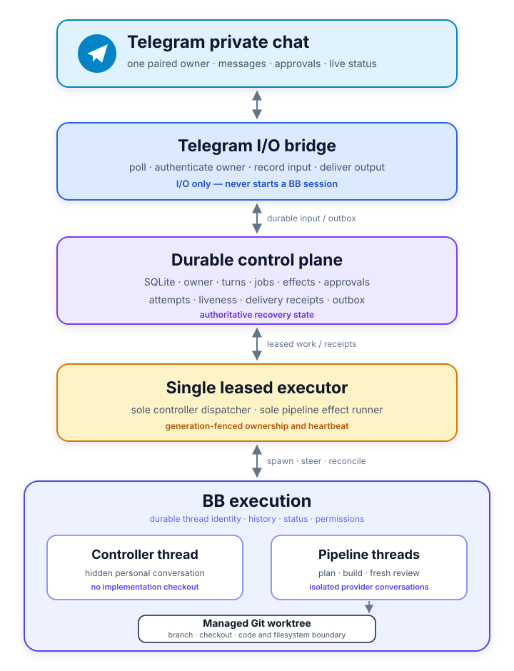
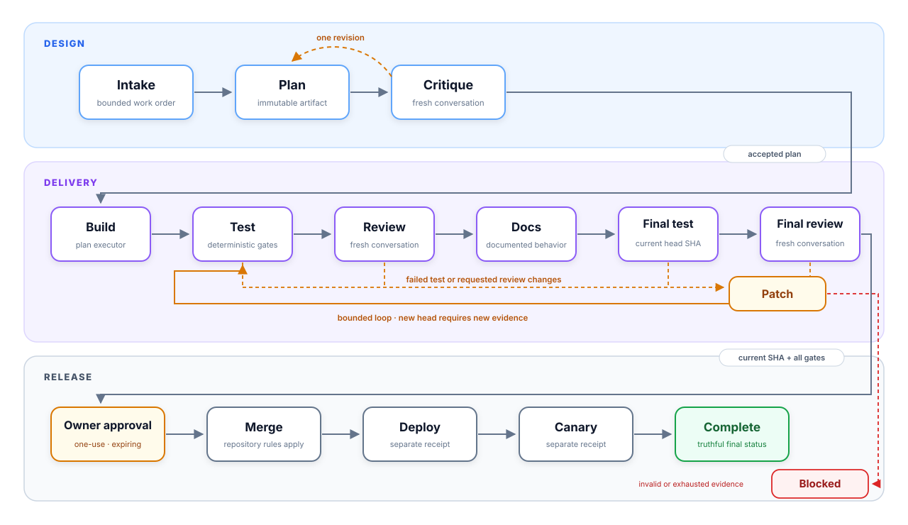

# Hanoon

Hanoon is a private Telegram AI agent for BB. One paired owner runs their whole BB installation from a phone: ask questions, drive threads and machines, set monitors that follow up on their own, and ship code through a reviewed pipeline from planning to merge, deployment, and canary verification.

The installed plugin and CLI namespace remain `telegram-agent`.

## Why Hanoon?

- **Run BB from Telegram, not from BB.** Hanoon has the shell, the `bb` CLI, installed skills and MCP servers, and reach across every connected machine. A question or permission prompt it hits reaches you in Telegram; a block it cannot render into buttons is still reported, naming the thread and saying it needs you in BB.
- **It remembers, and keeps it honest.** Standing preferences, decisions, and corrections persist in SQLite with full-text recall. Correcting Hanoon devalues whatever misled it, notes it never uses fade, and a correction retires the belief it contradicts.
- **It learns from finished work.** When a job ends, Hanoon works out what is worth knowing about that repository next time — a check that always fails for a known reason, a convention it enforces — and keeps it per project.
- **It follows up by itself.** Any thread Hanoon starts or messages is watched until it lands, including threads it did not open; you can also set a monitor on a schedule. When one fires, Hanoon does the work and messages you. It also runs its own daily and weekly upkeep, and stays quiet when nothing needs you.
- **It works in parallel.** Independent questions go out to several BB threads at once and come back as one answer.
- **Conversations survive failures.** A dead provider session retires a BB thread, not the conversation. The replacement resumes with what was said and what was already done.
- **Pipeline workers recover safely.** Silent or missing workers are retired and the exact stage is retried only for failure signatures that have recovered before; unfamiliar failures still stop for you.
- **Mutations happen once.** Every mutating tool call is receipted by turn and argument hash, so a recovered agent replays the result instead of repeating the action.
- **Fail closed at the merge boundary.** Review and validation bind to the full pull-request head resolved from Git, and approval is one-use and expiring unless that project holds a standing grant — from the owner's button tap, or from its own policy. A project may only carry that grant if GitHub already requires a status check on its base branch, and repository rules still apply either way.
- **Use BB's isolation model.** Threads isolate provider conversations and coordination; managed worktrees isolate branches, checkouts, and filesystem mutation.

## How it works

Hanoon has three layers:

| Layer | Responsibility |
| --- | --- |
| Telegram I/O | Poll the paired private chat, durably record input, and deliver drafts, status updates, confirmations, and final replies. |
| Durable control | Store owner pairing, project policies, controller turns and conversation digest, memories, monitors, tool receipts, jobs, effects, approvals, liveness, and the outbox in plugin SQLite. |
| BB execution | Run the hidden controller and visible planning, implementation, review, documentation, validation, merge, deployment, and canary work. |

Ingress never starts a BB session; it claims each Telegram update durably before anything acts on it. One generation-fenced executor owns controller dispatch, monitors, pipeline effects, and Telegram delivery. That executor may run bounded pipeline lanes for independent projects, while durable project claims keep each project serialized. Reviewers are newly spawned BB threads with fresh provider conversations; they reuse the implementation environment only to inspect the same worktree.

Agent sessions run out of process as BB threads and never open the plugin database, so the single-writer SQLite store stays uncontended: state transitions, their effects, memory writes, and the conversation digest all commit in one transaction.

## What Hanoon can do

| Capability | What it means in the chat |
| --- | --- |
| Full BB control | "Restart that host", "what's on machine two" — the shell and `bb` CLI on any connected machine, under the configured permission mode. Installing or connecting an integration needs your decision first. |
| Live thread insight | "Why is this taking so long?" answers from the thread's current step, todo list, running commands, and latest message — not just its status. |
| Thread management | Open a thread to explore something, message a running one to answer its question or redirect it, stop or retry with a one-tap confirmation. |
| Memory | "Always deploy on weekday mornings" is kept and applied later. Ask what it knows, or tell it to forget. Secrets are refused, never stored. |
| Voice notes | Send a Telegram voice note or audio message. Hanoon durably queues transcription without storing the audio bytes, keeps later messages in order, and tells you plainly when transcription is unavailable or too long for one message. |
| Reference documents | File project or global specifications, search their passages, and give every pipeline stage a bounded structural map of what governs the work. |
| Working style | "Be terser" or "always show me the PR link" sticks, without a code change. It can shape tone and habits, never a safety boundary. |
| Parallel work | "Compare the invoice spike and the billing latency" opens both at once and answers from what comes back. |
| Self-maintenance | Daily stale-work and read-only repository audits, bounded cleanup of old allowlisted plugin temporary directories, a weekly memory audit, and a weekly scorecard. Off by one setting; disk-pressure warnings remain active. |
| Monitors | "Tell me when this finishes and open a PR", or "every weekday at 9, summarise the overnight runs." |
| Thread notices | Every top-level thread reports itself: you are told when one finishes or fails, and a thread blocked on a question or a permission prompt asks you in Telegram with buttons. A block it cannot render is still reported, so nothing waits on you in silence. |
| Answers you can check | Every reply is an accepted structured finalization backed by evidence gathered in that same turn. Raw model prose never becomes an answer, and a claim without compatible evidence is rejected rather than sent. |
| Steering you can see | When the agent messages a worker thread it must say, in one line, what it asked for and why. You cannot see the threads, so that line is carried back on the reply that closes the turn: an instruction given in your name is visible while it still matters, not discoverable later. |
| Reviewed delivery | A guarded job takes a change from plan to a reviewed pull request; merging and production ask you in Telegram unless you have given that project a standing grant. |
| Unattended delivery | A project's policy can let it merge without asking, start work from its own daily audit, and revert an unattended merge that broke production. All three are off unless that policy asks for them, and each has preconditions before it is accepted. |
| Self-diagnosis | `/health` reports the executor, queued work, undelivered messages, monitors, memory, and database integrity — even when the agent is the stuck part. |
| Bounded turns | A question that runs away is nudged once to land the answer, then stopped before it burns your budget out of sight. |

## What an answer is

Every owner-visible reply is one accepted structured finalization, plus what the agent asked worker threads to do on that turn. Nothing else can become one:

- **Evidence in the same turn.** A claim about current state or completed work must reference evidence the agent gathered during that turn, with compatible proof kinds and a matching subject. Evidence is sealed at a high-water mark when the finalization is accepted, and an answer whose evidence advanced afterwards is refused rather than sent.
- **Raw prose reaches nothing.** Unstructured assistant prose never becomes a Telegram draft, a stored answer, a conversation digest, an outbox row, a finalization row, or a reply. BB still owns its own provider transcript. Drafts show one of the fixed phase lines, such as "Hanoon is thinking…", never partial output. The one exception is not prose: when BB blocks on a question or an approval, the provider's own prompt, options, and command are what the owner is being asked about, so they are carried through — each field bounded and credential-screened, and the whole interaction downgraded to an unanswerable notice if any field fails the screen.
- **What was asked in your name comes back.** Messaging a worker thread requires a one-line reason, recorded once the message has actually landed and owed to you until a reply states it. The reply is composed from that record rather than from anything the agent remembered to mention, so it cannot be skipped by wording. Because the record belongs to the agent rather than to one turn, an instruction sent by a turn that then dies is reported on the next reply instead of vanishing with it.
- **A bounded capability surface.** The controller runs against an enforced manifest of exactly 35 Hanoon capabilities. Denials are decided before any effect, and a stale executor fence or a stale approval is denied rather than retried.
- **Owner boundaries reach the phone.** A hidden-controller question or BB permission prompt is fetched from BB by exact identity, shown in Telegram, and answered by tap or plain reply. Approvals offer exactly *Allow once* and *Deny*; there is no session-wide grant on the hidden controller path. Your tap commits durably before BB is told, survives a restart, and is retried only for that exact resolution.
- **One logical reply, recoverable at-least-once transport.** The answer is one durable outbox obligation. Server-directed backoffs, transient failures known not to have sent, and uncertain brand-new sends remain on the same logical outbox row for bounded scheduler retries; an uncertain retry may duplicate the Telegram message, while edits retry against their stored message id. If uncertainty exhausts the retry budget, that same row becomes a vetted delivery-warning obligation with a fresh retry budget instead of disappearing silently. Enqueuing or attempting is never recorded as delivered.

## Credential broker foundation (disabled by default)

Hanoon carries the first slice of a separate credential broker: a protected service, run outside this plugin, that can answer a health check, a single vault-item resolve, and fixed provider-identity probes for enrolled Convex or Vercel targets. The Vercel browser operation is governed by the same typed contract but remains unavailable in the default server composition until an isolated browser administrator is supplied. **Credential broker mode defaults to `disabled`**; enabling it requires a protected broker host and the deployment's own reviewed provider acceptance evidence.

While it applies, this foundation only ever proves that the broker can reach a configured vault item — never that the resulting credential works for its application:

- `bb telegram-agent access list` and `bb telegram-agent access status [binding-id]` read local, secret-free metadata. `bb telegram-agent access reconcile <project-id> --projection-json <json> --json` imports only a validated, secret-free projection from protected-host enrollment while an active controller project/thread and executor lease are present; it never resolves or verifies a credential.
- The owner can ask Hanoon in Telegram to run a live verification of one known binding; a pass moves that binding to `vault_verified`, never `active`, and Hanoon never claims an application login succeeded from it.
- A protected-host operator enrolls a typed connector target with `connector binding enroll --stdin`. The broker atomically stores the encrypted target/reference and policy, then returns a secret-free projection for Hanoon reconciliation. No credential or live provider resource is created by enrollment.
- Connector inspection uses the exact selected capability and fixed adapter route. Current broker readiness, topology, audit, fence, receipt, and target identity are checked before and after dispatch; ambiguous retries reuse the persisted envelope.
- The checked-in recovery proof uses only local synthetic vault and TLS-provider fixtures. It proves controller-fenced projection reconciliation, bounded cancellation, receipts, restart/ambiguity replay, and canary absence without claiming that a live provider or credential was contacted.
- `bb telegram-agent doctor` reports one `credential broker` row, `disabled`, until isolated mode is configured, and one row per readiness check afterwards; see [Configuration](docs/configuration.md#credential-broker-foundation) and [Operations](docs/operations.md#credential-broker).

## Architecture

<p align="center">
  
</p>

Read the [architecture guide](docs/architecture.md) for diagrams, state ownership, and the exact BB thread/worktree boundary.

## Pipeline

<p align="center">
  
</p>

Critique can request one replacement plan. Test or review failures return to a bounded patch/test/review cycle. Full jobs require independent quality and risk reviews; small fixes still run deterministic validation plus one quality review. Existing open pull requests can be adopted with planning and critique recorded as skipped. Invalid evidence, stale pull-request heads, exhausted limits, novel worker failures, and expired approvals block instead of silently advancing.

The approval stage has two ways past it. By default it waits for your tap. A project holding a standing grant passes it without asking, on exactly the same evidence, and a change that argued with its own review twice still needs a second independent review before that grant covers it. A project with no production settings finishes at the reviewed pull request unless its policy opted into merging without one, which ends the job at `merged` with nothing to deploy. See [Configuration](docs/configuration.md#unattended-delivery) for what a project must have before it may do any of that.

The project policy chooses implementation/review providers and commands. The conversational agent is configured independently and defaults to Claude Opus 5 (1M) at `xhigh` reasoning. Claude Code, Codex, Cursor, and Grok models are selectable; the catalog picks the provider for each model id. The concurrent-job cap defaults to `5`, accepts `1`–`8`, and applies to later admissions without cancelling work already admitted.

### Adaptive capability routing

New jobs are admitted as navigator-v1 in deterministic mode. The classifier, recipe policy, stage projection, and recipe-keyed skill or model selection do not control or admit new work. A leftover `task_recipe` column may remain on the job row, but it does not route new work.

Historical recipe promotion still exists as leftover recipe-v1 history. Adaptive recipes defaulted to `shadow`, where candidate routing was observational and could not control production behavior or manufacture success receipts. A recipe became active for leftover jobs only after an append-only promotion decision backed by a resolved durable evidence ledger. The production reader verifies recorded artifacts, an active post-merge job, failure/recovery chronology, and model trials against authoritative SQLite rows. This release exposes no operator or typed-envelope ingestion path and includes no trusted live collector, so a fresh installation cannot produce promotion evidence and no leftover recipe is enabled merely because deterministic tests pass. See [Operations](docs/operations.md#capability-routing-and-rollout) for inspection and rollback commands.

## Bundled agent skills

The plugin carries a deterministic 35-skill catalog. It vendors the 25 skills in the reviewed Matt Pocock plugin manifest at revision `6654f6b60cd9d5be8b54c6fafe44346dabeb3b76`, plus ten Hanoon, guard, delivery, writing, and communication skills. Superpowers workflow ids, the duplicate discovery root, and the proportional workflow router are not installed. Every source tree, invocation class, provenance record, license, and supporting file is locked locally. Plugin startup performs no skill download or repair, and it refuses to start while a nonterminal recipe-v1 job still needs a legacy skill or state handler.

BB discovers skills one directory below each registered root, so the manifest registers the Matt Pocock `engineering` and `productivity` buckets separately. New work uses the workflow navigator. Historical recipe columns, descriptors, and receipts remain readable.

| Verified context | Selected skill ids |
| --- | --- |
| controller | `driving-bb`, `unslop`, and on an explicit grill request `grill-with-docs`, `grilling`, `domain-modeling`. Conduct requires unslop on every owner-facing message. |
| planner | `unslop`, `writing-for-agents`, `docs-guard` |
| critic | `unslop` |
| implementation | `unslop`, `diagnosing-bugs`, `tdd`, `clean-code-guard`, `test-guard`, `durable-boundary-audit`, `pr-writer` |
| review | `unslop`, `clean-code-guard`, `test-guard`, `durable-boundary-audit`, `blast-radius`, `code-review` |
| documentation | `unslop`, `technical-writing`, `docs-guard` |
| final-review | `unslop`, `clean-code-guard`, `test-guard`, `docs-guard`, `durable-boundary-audit`, `blast-radius` |
| validation, merge, deploy, canary | none; these stages remain deterministic |

The admission catalog records whether each skill is model-invoked or must be explicitly scheduled by the owner or workflow navigator. General worker selection rejects user-invoked skills. A skill never grants tools, credentials, merge authority, or production authority.

Selection is fail-closed. Structurally, a worker must be from plugin `telegram-agent` with a non-fork origin, use a `standard` project and a `managed-worktree`, and have an anchored title of the form `Telegram <jobId> <role-token> <attemptId>`. Job ids are 1 to 256 characters from `[A-Za-z0-9_-]`; attempt ids are 1 to 264 characters from `[A-Za-z0-9_.:-]`. Durably, the exact attempt or stage record, effect, project, environment, thread, role, and routing mode must match. Any mismatch receives no tools and no skills.

`npm run skills:verify` validates the registered roots, the schema 2 lock, the 35-skill catalog with empty legacy and shadow lists, bounded regular files, frontmatter, nested local Markdown resources, provenance, licenses, and every SHA-256 file digest. Success prints a bounded `bundleDigest`, `admittedSkillCount`, and `legacySkillCount`. Build and activation run the same verifier before plugin code can register. A missing, unlocked, escaped, oversized, symlinked, malformed, leftover-kit, or digest-mismatched bundle fails closed.

A maintainer can refresh the promoted portfolio only from an already-reviewed clean local checkout at the pinned full revision:

```bash
MATT_SKILLS_SOURCE=/absolute/path/to/mattpocock-skills
MATT_SKILLS_REVISION=6654f6b60cd9d5be8b54c6fafe44346dabeb3b76
npm run skills:sync -- --source "$MATT_SKILLS_SOURCE" --revision "$MATT_SKILLS_REVISION"
```

The synchronizer verifies the checkout identity, manifest, package metadata, license, promoted paths, invocation metadata, and bounded source tree before atomically replacing `skills/matt-pocock` and the lock. It has no runtime role.

> [!WARNING]
> This is a full-trust BB plugin. Fresh or unset controller permission settings resolve to `auto`; an explicitly saved `auto`, `accept-edits`, or `full` value is preserved. BB-native permission prompts raised for the hidden controller can be bridged into Telegram as *Allow once* / *Deny*. An enabled project policy may run owner-authored validation, deployment, and canary commands.
>
> Merging a pull request and promoting to production require a Telegram approval from the owner, one-use and expiring — **unless that project holds a standing grant**. A grant comes either from the owner's own button tap or from `autonomy.unattendedMerge` in the project's policy, and both replace the owner's signature and nothing else: every review, validation, and evidence gate still runs. `bb telegram-agent project enable` refuses to store either grant unless GitHub already requires a status check on that base branch, and warns when the protection does not bind administrators. `/approvals off` withdraws a grant, and a failed production rollback withdraws it automatically and stops the project taking new work.
>
> Review the source and policy, keep GitHub protection enabled, and use a disposable repository for the first live run.

## Quick start

### 1. Install from a checkout

Requirements: BB `0.36` or newer, npm, an authenticated GitHub CLI on each project source host, a standard BB GitHub project, access to at least one of Claude Code, Codex, Cursor, or Grok, and a Telegram bot from [BotFather](https://core.telegram.org/bots#botfather).

```bash
npm ci
npm run check
bb plugin install . --yes
bb plugin enable telegram-agent
bb plugin reload telegram-agent
```

### 2. Configure and pair

In **Extensions → Plugins → Telegram Agent**, enter the Telegram bot token in the secret setting. The model, reasoning level, service tier, permission mode, and maximum concurrent jobs are on the same page; the defaults are ready to use.

```bash
bb telegram-agent pair
bb telegram-agent doctor
```

Open the sensitive, ten-minute pairing link from the intended owner's private Telegram chat.

### 3. Enable a project

Create a reviewed project policy, then enable and validate it:

```bash
bb telegram-agent project enable proj_7f3d2a91 --policy-file /absolute/path/to/policy.json
bb telegram-agent doctor proj_7f3d2a91
```

The policy defines the exact GitHub repository/base branch, worker profiles, validation commands, required checks, redaction patterns, review limit, merge method, and optional deployment/canary commands. Projects that deploy to the same target can share `production.targetKey`, which serializes that target even when their repositories differ. See [Configuration](docs/configuration.md) for the complete verified schema and examples.

Self-healing is off by default. To enable it, set the boolean `selfDiagnosisEnabled` to `true`, set `selfDiagnosisProjectId` to the enabled project containing this checkout, and reload the plugin. It inspects persisted controller and pipeline job failures out of band, requires the fixing worker to report what verification ran before any fix is proposed, and proposes at most one cooled-down fix at a time, messaging the owner the link without asking. `selfDiagnosisMode` decides what that fix becomes: `draft-pr` (the default) pushes a branch for you to read, and `pipeline` files it as an ordinary reviewed job instead, under the same `autonomy.intake` allowance and finding ledger as the daily audit. Neither mode merges anything or changes an existing pull request.

### 4. Talk to Hanoon

Send a normal private message. Hanoon answers conversationally, and acts when asked. Screenshots, GIFs, and short videos are part of the same turn — clips are sampled into stills the agent can see.

```text
what's running right now?
why is the billing thread taking so long?
open a thread on cyndra to look into the invoice spike
tell me when it's done and summarise what changed
always deploy parknwash on weekday mornings
/health
```

Recovery commands remain available without the agent: `/status`, `/projects`, `/health`, `/approvals`, `/resume`, `/retry [job-id]`, `/cancel [job-id]`. `/status` lists current jobs; replying to a job status message or supplying its id selects that exact job. `/approvals` lists the projects that merge without asking and says whether each was granted by button or set in its policy; `/approvals off [alias]` withdraws one, or all of them with no alias. `/resume` lists the projects the failure brake stopped and `/resume <name>` starts one, or `/resume all` starts every one. Merging still requires a Telegram approval unless that project holds a standing grant.

## Documentation

| Guide | Use it for |
| --- | --- |
| [Documentation index](docs/README.md) | Find operator, contributor, security, and design-history material. |
| [Architecture](docs/architecture.md) | Understand ownership, durability, review isolation, and worktree boundaries. |
| [Configuration](docs/configuration.md) | Install, pair, select a controller profile, and enable project policies. |
| [Operations](docs/operations.md) | Inspect, retry, cancel, rotate credentials, recover, and remove. |
| [Disposable live acceptance](docs/live-acceptance.md) | Prove the end-to-end pipeline without risking a production repository. |
| [Contributing](CONTRIBUTING.md) | Set up development and prepare a reviewable change. |
| [Security](SECURITY.md) | Report vulnerabilities and understand the trust model. |

## Repository layout

```text
hanoon/
├── src/
│   ├── bb/           # BB thread, environment, handoff, validation, and merge adapters
│   ├── controller/   # Durable conversational controller and guarded native tools
│   ├── domain/       # Project policies, job state machine, review, and pipeline graph
│   ├── services/     # Leased executor, effects, review, merge, production, and liveness
│   ├── storage/      # SQLite migrations and transactional store
│   └── telegram/     # Telegram API client, ingress, errors, and bounded rendering
├── tests/            # Unit, integration, state-machine, and mocked end-to-end coverage
├── skills/           # Pinned admitted catalog plus temporary recipe compatibility skills
├── evals/            # Golden answers for the opt-in response-quality check
├── docs/             # Public guides plus design/implementation history
├── server.ts         # BB plugin entry point
└── package.json      # Plugin manifest and verification scripts
```

## Development

```bash
npm ci
npm run typecheck
npm run skills:verify
npm run build
bb plugin types --check .
```

Type checking resolves `@bb/plugin-sdk` through `types/bb-plugin-sdk.d.ts`, which `bb plugin types` regenerates from your installed BB. Building needs only the `bb` CLI.

> [!NOTE]
> The test suite additionally imports `@bb/plugin-sdk/testing` at runtime. BB does not publish that package to a registry, so `npm test`, and therefore `npm run check`, only works where the package is installed. `npm run check` runs typecheck, tests, the plugin build, artifact verification, and the credential-broker TypeScript build. Type checking and building work from a clean clone.

See [CONTRIBUTING.md](CONTRIBUTING.md) for change boundaries, documentation checks, and pull-request evidence.

## Project status

Version `0.1.0`, installed directly from a checkout. There is no package registry or release channel. The repository is licensed under the [MIT License](LICENSE).
