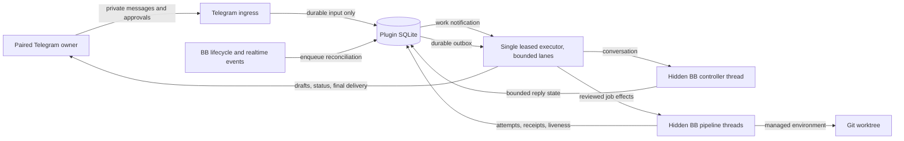
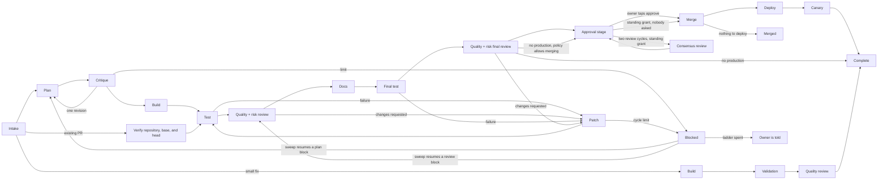

# Architecture

Telegram Agent is a full-trust BB plugin that turns one paired private Telegram chat into a durable controller for reviewed software delivery. Telegram is the operator interface; BB owns agent conversations, environments, worktrees, and merge execution; SQLite owns the plugin's recoverable control state.

## System model

The system has three layers:

1. **Telegram I/O** polls updates, validates the paired private owner, records accepted input, and delivers drafts, status edits, callbacks, and final messages. Photos, image files, GIFs, and short videos are accepted on the same owner turn. Stills attach as BB images. GIFs and videos are downloaded and sampled into an ordered set of stills the controller can see; if sampling is unavailable, Telegram's preview still is used instead.
2. **Durable control** stores pairing, controller turns, jobs, immutable policy snapshots, effects, approvals, attempts, liveness, and the Telegram outbox in the plugin database.
3. **BB execution** runs the hidden conversational controller and hidden planning, implementation, review, documentation, validation, merge, deployment, and canary workers. The owner hears about that work through Telegram job cards, not BB sidebar threads.

Ingress, BB lifecycle events, and BB realtime thread or environment changes do not start agent sessions. They record or enqueue work and nudge the executor. A completed reconcile for a worker thread can be re-armed when that thread or its environment changes again, so a job that stays active is observed again instead of going stale until the next scheduled poll. The single generation-fenced executor is the only component that dispatches controller turns, spawns pipeline threads, runs effects, or delivers Telegram output. Within that authority it can run a bounded number of independent project lanes concurrently.

## Ownership and data flow



The executor renews one authoritative lease heartbeat. A second instance may poll for the lease, but it cannot run a fenced effect or merge on behalf of the current generation. Lane concurrency does not create more executor authorities: each durable write and provider boundary remains fenced by the same owner and generation.

## Admissions and resource ownership

An admission is the durable scheduling record for a job:

- `queued` means the request is waiting for the global cap or its project claim;
- `admitted` means it occupies a concurrency slot and holds the project's pipeline claim;
- `draining` means terminal state is durable but authoritative worker/effect cleanup still owns the slot;
- `released` means cleanup completed and the slot and held claims no longer block later work.

The configured cap is global, but a unique held project claim permits only one admitted job per project. FIFO queue order decides between jobs for the same project; work from other free projects can fill the remaining slots.

Merge-time claims add two narrower exclusion boundaries. A normalized `repository_merge` claim serializes merges to the same GitHub repository. A configured production policy also takes a `production_target` claim; `production.targetKey` lets distinct projects name a shared target, while an omitted key falls back to the project id. Claims are acquired in the fenced merge lease transaction and exposed as bounded kind/key wait projections.

After an executor restart, the successor reconciles the exact job before adopting that job's held claims under its new generation. It never adopts another job's claims. A merge whose provider outcome may have started but is unknown retains its repository and production claims until provider truth is reconciled.

## Reviewed delivery pipeline



The planner writes a bounded plan artifact. Its verification section must reproduce the policy's exact commands in a table that expects exit code `0`, or use the exact explicit-skip line when the policy has no commands. The critic receives the work order and plan as immutable project attachments in a fresh BB thread. The implementation worker receives the accepted plan without inheriting the planner's provider conversation.

After implementation produces a pull request, deterministic validation runs before fresh review threads are spawned in the same BB environment. Full jobs require independent quality and risk verdicts; small fixes require only the quality verdict. The group cannot advance until every required lens has durable evidence for the exact head. A reviewer never forks or resumes the implementation conversation. A changes-requested verdict returns bounded findings to the implementation thread; a new pull-request head requires new validation and another fresh review group.

Every worker stage receives a bounded structural map of the reference documents in scope. Each briefing identifies included and omitted documents by stable document id and version. A map preserves all top-level headings when they fit and explicitly marks structure omitted by tighter limits. When a reference disagrees with the requested outcome or governing rule, the stage uses BB's owner-question interaction and waits for the answer before continuing. The interaction is durable and resumes that exact worker after restart. Merely reporting the conflict is not a valid stage result. Implementation-detail disagreements are reported without stopping the pipeline.

Documentation, final validation, and final review happen before the approval stage when production is configured. That stage has two ways past it. By default the owner receives a one-use, expiring approval bound to the exact head. A project holding a standing grant passes it without being asked, on the same evidence, and the use is recorded in the append-only merge-authority log before the merge is set in motion. Documentation may be skipped only with a strict report and an observed clean, empty documentation diff. If production is not configured, a successful final review completes the job at the reviewed pull request, unless the project's policy opted into merging without production: that project routes to the same approval stage, passes the same gates, and ends at the terminal `merged` state with no deploy or canary to run. A small-fix job skips planning, critique, documentation, and final review, but still must pass deterministic validation and one independent quality review. An adopted pull request records planning and critique as honestly skipped after verifying its repository, base branch, URL, remote head, and deterministic local branch, then enters the normal full validation/review/finish path. Merge, deploy, and canary each produce separate durable receipts. A successful merge followed by a failed deploy or canary is recorded as `production_failed`; the plugin does not claim completion. It runs the policy's rollback command when one is configured, in the failing stage, before reporting.

### Merging without being asked

The approval stage is where the owner's signature goes. A project can hold a standing grant that replaces that signature and nothing else: every gate that produced the merge candidate still runs, and a job that fails one falls back to asking. A grant comes from the owner tapping **Merge + deploy, and always from now on**, or from `autonomy.unattendedMerge` on the job's own immutable policy snapshot.

Three things bound it, and none of them is this plugin trusting itself.

**GitHub has to enforce something.** `bb telegram-agent project enable` asks GitHub, live through the authenticated `gh` CLI, whether the policy's base branch has branch protection or a ruleset requiring at least one status check. It refuses to store the grant when it does not, and a 404, an error, an unparseable answer, and a protection requiring nothing all read as "it does not". Protection that does not bind administrators is accepted with a printed warning instead, because the protection is real and this plugin merges with an owner-scoped token GitHub may exempt from it. The check runs at enable time and in the project doctor, never on the merge path itself: that path is fenced and deterministic, and a network call inside it would be one more way for a merge to be decided by something other than durable evidence.

**A change that argued with its review still stops.** Two or more remediation rounds is the shape a standing grant should not wave through. Those changes need one extra independent review of the exact head, on a provider the review stage did not use, and only an unambiguous pass merges them.

**A production failure that could not be undone takes the grant back.** A failed deploy or canary whose rollback was missing or itself failed withdraws both grant sources durably and trips the failure brake for that project, so no new work is admitted there until the owner sends `/resume <alias>`. The brake is recorded without a fingerprint, which is what makes it the owner's to lift rather than the agent's — and it is recorded that way even when the project was already braked for something smaller, because a fingerprint is the agent's own way out and this incident must not leave the project easier to restart than it already was. A rollback that succeeded is a recovery and costs the project nothing.

### Carrying a blocked job onward

Every recoverable block already had a resume path in the state machine, but nothing walked it: the owner was the scheduler, and a job that hit one bad minute waited for a tap that might never come. A sweep now decides, for each blocked job, whether it can be driven on, and applies the same guarded `RETRY` or `CONTINUE_REVIEW` the owner's own buttons use. An automatic push therefore cannot reach a state a manual retry could not.

Jobs already blocked when the sweep first shipped are excluded by a one-time backfill that marks them handed-over. They stopped under the old rules against branches and environments that have since moved on, and resuming them would have made the sweep's first act a rerun of history nobody was waiting on.

The ladder is bounded at three attempts against the same block, counted per block rather than per job, so a job that clears one wall and stops at a later one arrives with a full allowance. When the ladder is spent the owner is told once, in plain language, and the job stops being re-decided. Merge and production promotion need authority the sweep cannot invent, and re-entering them unwatched is a behaviour a project has to ask for: it drives past that boundary only when the project's **current enabled policy** sets `autonomy.unattendedMerge`, that grant is still live, and no failure brake is holding the project. A standing approval the owner tapped grants unattended merging and nothing else, so a button-only project keeps waiting for their retry exactly as it always did. Where the sweep may re-enter, it may only re-fire that stage's own guarded effect, so the gates, the receipts, and the auto-approval decision all run again from scratch. It never drives past an unconfirmed cancellation or a project configuration gap it cannot fix.

Effects that only redraw state the job already holds cannot end a job. A status card that fails to deliver, whether dead-lettered outright or out of retries, is a display problem: blocking the work over it loses real progress and tells the owner nothing, because the block enqueues another status render that fails the same way.

## Adaptive capability control plane

The capability control plane sits before provider work and reuses the delivery state machine rather than replacing its merge or production fences:

```mermaid
flowchart LR
    Request --> Classifier[Traits + six recipes]
    Classifier --> JobSnapshot[Recipe + legacy/shadow/active mode]
    JobSnapshot --> Profile[Immutable least-capability profile]
    Profile --> Route[Exact model tuple]
    Route --> Provider[BB provider boundary]
    Provider --> Outcomes[Append-only trials and capability outcomes]
    Outcomes --> Gate[Native, validation, and guard gates]
    Gate --> Transition[Authoritative job transition]
```



The pinned catalog validates every admitted skill, controller bundle, native adapter, model-pool marker, and recipe descriptor by digest and dependency graph. Profiles bind the catalog and graph digests, recipe/version, routing mode, exact model tuple, selected assignments, traits, and reason codes to one controller turn or worker attempt. A profile is written before its provider call. Selected mandatory capabilities receive exactly one terminal outcome before their stage may advance; native-adapter outcomes commit in the same SQLite transaction as the transition they authorize.

The six recipes are `direct`, `bounded`, `bug`, `skill-authoring`, `adopted-pr`, and `architectural`. Their graphs express direct diff guards, approved-design implementation, diagnosis plus regression, skill baseline proof, adopted-pull-request inspection, and plan/critique plus task and integrated review respectively. Later evidence can raise rigor at most twice, never downgrade it, and the persisted job snapshot survives retry and restart.

Active model routing pins provider, model, reasoning, and service tier before spawn. One equivalent provider failure retries the same tuple; a second escalates only the next provider call from `fast` to `standard` to `strong`. It never switches within an attempt or downgrades after restart. A second equivalent failure at `strong` blocks. Permission remains a separate policy field.

Review guards are selected from the canonical exact-head diff. Their strict envelopes bind profile revision, head SHA, diff digest, descriptor digests, and bounded findings. Mandatory outcomes are checked again at the executor transition. The same mandatory finding requests remediation twice and blocks on its third occurrence in the durable job/review lineage.

External provider, model, plugin, and skill discovery is read-only and deadline-bound. A failed refresh preserves the previous snapshot with degraded health. Discovered entries stay `inventory-only`: discovery alone grants no execution authority, and admission requires a validated descriptor, explicit role/recipe/stage mapping, and at least five compatible shadow trials.

Rollout is per recipe. `shadow` computes candidate profiles and routing evidence without controlling provider behavior or recording candidate success as production truth. `active` can control only after a durable promotion decision; rollback affects new jobs while retaining profiles, receipts, trials, and in-flight snapshots. The production promotion reader resolves the newest append-only manifest against integrity-bound deterministic and classifier artifacts, safety snapshots, an active post-merge job, distinct failure/recovery receipts, and terminal candidate/baseline model trials. Trial settlement timestamps must prove failure before recovery, both receipts before merge, merge before the live-run record, and that record before the manifest. A missing, corrupt, duplicate, cross-recipe, reversed, or mismatched reference makes the whole manifest incomplete; it never falls back to older proof.

Recipe promotion still has no trusted live collector, CLI ingest path, controller tool, or plugin callback that can manufacture those records. Typed pass/fail assertions cannot create a recipe ledger. A fresh installation therefore keeps every adaptive recipe in `shadow`, and `capability promote <recipe>` fails closed until a later collector proves a disposable live job.

Navigator-v1 is a separate engine gate. `DualEngineCoordinator.persistEvaluationEvidence` is the trusted append seam: it records the fixed corpus, measured restart and safety counters, and the required disposable live scenarios, then writes one integrity-bound manifest. It refuses a SQL-stamped terminal job that was never executed. `capability promote navigator-v1` / `capability rollback navigator-v1` consume that ledger for new admissions only. The **Workflow engine graph** setting (`adaptive` or `recipe`, default `adaptive`) is an independent new-job kill switch: `recipe` keeps later admissions on recipe-v1 even after a reviewed navigator promotion. After that promotion, the leased executor runs the live navigator, implementation, and release workers. Jobs never change engines in place.

## Agent skill runtime

The repository locks one reviewed 35-skill admitted catalog and a temporary recipe-v1 compatibility catalog. The admitted catalog combines 25 promoted Matt Pocock skills at revision `6654f6b60cd9d5be8b54c6fafe44346dabeb3b76` with ten retained platform, guard, delivery, writing, and communication skills. Fifteen legacy-only workflow ids remain executable only so existing recipe jobs can finish. No runtime path downloads or repairs skills.

BB reads one level of child directories from every plugin skill root. The package therefore registers both Matt Pocock buckets, not their common parent. The three promoted ids that overlap the historical discovery root remain digest-locked under an unregistered compatibility subtree, leaving one runtime source for every id while recipe-v1 drains. The promoted descriptors stay admitted for navigator-v1. Skill expansion alone does not start those workers. New admissions reach navigator-v1 only after a reviewed promotion while **Workflow engine graph** is `adaptive`, and only then does the leased executor run the live navigator, implementation, and release workers.

| Registered root | Source | Purpose during expansion |
| --- | --- | --- |
| `skills/workflow-kit` | pinned legacy workflow kit | 14 legacy-only recipe skills |
| `skills/guards` | [guard-skills](https://github.com/amElnagdy/guard-skills) | `clean-code-guard`, `test-guard`, `docs-guard` |
| `skills/delivery` | [getsentry/skills](https://github.com/getsentry/skills) | `pr-writer` |
| `skills/discovery` | [mattpocock/skills](https://github.com/mattpocock/skills) at the historical revision | recipe-v1 copies of `grill-with-docs`, `grilling`, and `domain-modeling` |
| `skills/matt-pocock/engineering` | [mattpocock/skills](https://github.com/mattpocock/skills) at the reviewed revision | promoted engineering skills |
| `skills/matt-pocock/productivity` | same reviewed source | promoted productivity skills |
| `skills/hanoon` | first-party, with source notices where adapted | four retained platform skills and one legacy router |
| `skills/pstack` | [cursor/plugins](https://github.com/cursor/plugins) at revision `60c641e4fad674784b30abcf9f8915dea39df38d` | `unslop` and `technical-writing` |

Each lock record binds the skill id, source path, source revision, source digest, descriptor digest, license, and invocation class. The three discovery collisions also have exact shadow records, proving which historical source remains first for legacy execution without admitting a second capability identity. The 35-skill admission catalog allows model-invoked skills in general workers and requires an explicit navigator or owner route for user-invoked skills.

The existing recipe-v1 role matrix remains unchanged during expansion:

| Verified role/context | Selected skill ids |
| --- | --- |
| controller | `driving-bb`, `unslop`, `proportional-development-workflow`, `grill-with-docs`, `grilling`, `domain-modeling` |
| planner | `unslop`, `writing-plans`, `docs-guard` |
| critic | `unslop` |
| implementation | `unslop`, `systematic-debugging`, `test-driven-development`, `verification-before-completion`, `clean-code-guard`, `test-guard`, `durable-boundary-audit`, `pr-writer` |
| review | `unslop`, `clean-code-guard`, `test-guard`, `durable-boundary-audit`, `blast-radius` |
| documentation | `unslop`, `technical-writing`, `docs-guard`, `verification-before-completion` |
| final-review | `unslop`, `clean-code-guard`, `test-guard`, `docs-guard`, `durable-boundary-audit`, `blast-radius` |
| validation, merge, deploy, canary | none; these remain deterministic stages |

Role selection still requires the exact durable attempt or stage, project, managed worktree, thread title, effect, environment, and routing mode. A mismatch returns no tools and no skills. Historical capability descriptors and registry digests remain unchanged, so existing receipts and nonterminal recipe jobs retain their original interpretation.

### Bundle integrity and maintenance

`npm run skills:verify` checks the package root order, schema 2 lock, exact active, legacy, and shadow catalogs, bounded regular files, complete SHA-256 coverage, frontmatter identity, invocation metadata, nested local Markdown resources, and all source provenance and licenses. Build and activation run this verifier before registration. Drift, missing support files, a path escape, a symlink, malformed metadata, a duplicate catalog entry, or an admitted `do-*` id stops activation. The verifier never changes the bundle.

Synchronization is a maintainer-only operation from a clean absolute checkout at the reviewed full commit:

```bash
MATT_SKILLS_SOURCE=/absolute/path/to/mattpocock-skills
MATT_SKILLS_REVISION=6654f6b60cd9d5be8b54c6fafe44346dabeb3b76
npm run skills:sync -- --source "$MATT_SKILLS_SOURCE" --revision "$MATT_SKILLS_REVISION"
```

The command verifies source identity, package and plugin metadata, the MIT license, the exact promoted manifest, invocation frontmatter, OpenAI metadata, tree bounds, and cleanliness. It stages the complete promoted subtrees and atomically replaces only `skills/matt-pocock` and `skills/skills.lock.json`.

## BB threads and worktrees

BB threads and Git worktrees solve different isolation problems:

| Boundary | BB thread | Managed worktree |
| --- | --- | --- |
| Provider conversation | Isolated identity and history | Not applicable |
| Status and interactions | Durable per thread | Not applicable |
| Model, reasoning, and permissions | Resolved per turn/thread | Not applicable |
| Visibility and parent-child coordination | Owned by BB | Not applicable |
| Branch and checkout | References an environment | Owns the checkout |
| Uncommitted files and artifacts | Shared when threads reuse an environment | Isolated from other worktrees |
| Filesystem mutation | Runs through the thread's environment | The actual mutation boundary |

The conversational controller runs in a hidden personal workspace and has no implementation checkout. Planning creates or reuses the job's managed worktree. Implementation, review, documentation, and validation threads that reuse that environment see the same files, even though their provider conversations remain separate. Each implementation worktree also has a gitignored `PROGRESS.md` scratchpad. Workers read it on entry and update it at meaningful milestones so a replacement session can continue after context compaction or recovery without turning transient notes into a commit.

## Durable state

The plugin database records:

- one owner identity and expiring pairing codes;
- enabled project policies as immutable versioned snapshots;
- controller thread identity, FIFO turns, streaming cursors, and delivery state;
- every controller thread generation with its lifetime and the reason it was retired;
- a rolling conversation digest of answered turns;
- long-term memories with full-text search, supersession, and provenance;
- project and global reference documents, their structural maps, searchable passages, version changes, and section digests;
- tracker-backed work artifacts, stable external bindings, typed parent and blocker edges, immutable content snapshots, snapshot invalidations, fenced claims, and evidenced resolutions;
- tool receipts keyed by turn, tool name, and argument hash;
- armed monitors, their trigger, and their firing history;
- watched threads with their last reported status, and the interactions offered to the owner with their answers and delivery state;
- jobs, queue admissions, resource claims, state-machine versions, stage attempts, and immutable handoff digests;
- idempotent effects and retry accounting;
- executor lease ownership and worker liveness;
- merge approvals, callback consumption, and production receipts;
- a durable Telegram outbox.

Restart recovery resumes from these records. It does not infer success from a missing process, stale provider output, or an HTTP success alone.

The configured tracker remains the editable collaboration surface. GitHub issue update APIs and `gh issue edit` expose no documented revision precondition, so Hanoon never replaces a GitHub issue body, native relationship set, dependency set, or assignee set after a client-side read. Owned sections continue to use append-only comments. Parent, blocker, and visible claim mutations first append a payload-bound intent, then use one targeted native add or removal, require the exact native read-after state, and finally append completion evidence. Completion comments are evidence only and never project missing native state. GitHub documents `gh issue edit --add-sub-issue`, `--add-blocked-by`, and `--remove-blocked-by` as targeted relationship operations. GitHub's issue assignee API guarantees that adding named assignees does not replace users already assigned, while removal names only the assignees to remove. Hanoon therefore preserves unrelated human relationships and assignees, and fails closed when an interrupted or concurrent result does not exactly match the durable intent. Terminal state changes remain targeted close operations. Every replayable marker binds its operation identity to a digest of the normalized payload. A project without a supported remote can use one Markdown file per artifact with explicit status and blocker fields. The coordinator applies each tracker mutation only while the same executor generation owns the lease, then checks that exact generation and commits the resulting observation inside one immediate SQLite transaction. A create intent binds the artifact, durable operation, tracker kind and namespace, tracker operation, and normalized create digest before any external create. Restarts reconcile only through that immutable identity. An applying parent, resolve, or cancel operation is completed only when the exact payload marker and independently observed tracker state agree. Missing or contradictory evidence records one durable indeterminate outcome. Claim release evidence is reconciled before a changed visible assignee can invalidate the held claim, and matching release settlement and observation are atomic. SQLite keeps the exact snapshot accepted by a worker. A material remote edit invalidates an active snapshot and claim. Closing an external artifact records that observation, but only controller evidence bound to the current artifact and snapshot can mark it resolved. Before requesting closure, the coordinator appends a resolution intent bound to that snapshot and external revision. It finalizes the internal terminal state only after observing the matching tracker outcome. An edit between those steps leaves the old intent as history and cannot complete the changed artifact. The reference index may ingest the current snapshot for retrieval; it never replaces the tracker or immutable snapshot history. This substrate does not change recipe-v1 routing on its own; navigator integration selects and drives it later.

Local Markdown creation publishes only a fully synced candidate. Replacement uses a cross-process mutation journal, moves the exact current file into that journal, verifies its digest, and publishes the candidate only if the target path is still absent. The fallback fails closed outside Linux. On Linux, mutation locks bind both the PID and `/proc` process start identity, so PID reuse cannot preserve a dead writer's lock. Every filesystem mutation binds the configured repository root device and inode, verifies that the canonical parent remains inside it, captures the target directory descriptor, and addresses the artifact through `/proc/self/fd`. Swapping an ancestor before or after descriptor capture cannot redirect the write. The repository and tracker directory chain also rejects symlinked ancestors. A human atomic save during that interval wins instead of being overwritten, and an abandoned journal restores the captured file after restart. GitHub issue bodies and comments travel to `gh` through `--body-file -` and terminal stdin, so collaboration content is absent from process arguments. GitHub repository identities are canonical owner and name pairs across namespaces, external identifiers, comparisons, and CLI arguments. Native relationship reads preserve repository identity and fail closed on incomplete or cross-repository connections. Create reconciliation combines indexed marker search with a direct all-state issue scan paginated to exhaustion. Both commands filter to bounded issue-number candidates before output reaches the terminal runner, then the gateway hydrates only those candidates. Negative reconciliation is therefore conclusive before search indexing catches up without relying on retained raw repository JSON. Issue hydration projects core fields without comments and assigns a capture budget using the validated field limits, the six-byte worst case for one JSON-encoded UTF-16 code unit, fixed JSON structure, and terminal envelope allowance. Comments are read eight at a time in ascending ID order with the same encoded-size bound per page. A validated short page terminates pagination, IDs must advance, and identical core reads around the pages corroborate one stable observation.

## Conversation continuity

A BB thread is one disposable execution generation serving a durable conversation. When a provider session fails, the thread is retired — recorded, not erased — and the next message opens a replacement seeded with:

- the recent conversation digest, so the owner is not asked to repeat themselves;
- the memories relevant to the new message;
- receipts for what the previous generation already did for that message.

Each answered turn writes its digest entry in the same transaction that records the answer, so a crash cannot leave a delivered reply that the next generation has no record of.

## Memory

Memories are typed (`preference`, `fact`, `decision`, `correction`), scoped to the owner globally or to one project, and start with a deterministic blend of BM25 relevance, recency decay, importance, and confidence. A background local embedding service backfills semantic vectors without an API key. Semantic similarity contributes 30 percent only when both the query and memory already have vectors; otherwise the original score is unchanged. An owner query never initializes or downloads the model inline. A memory write commits in the same transaction as the FTS5 row it indexes, while vector backfill is independently retryable.

Restating a subject supersedes its predecessor instead of overwriting it, so corrections keep their history. Credential-shaped text is refused at the write, and the owner's explicit standing instructions ("always…", "never…", "remember that…") are captured at intake so they survive even if the answer itself fails.

## Monitors

A monitor is a durable obligation, not a reminder. It watches a BB thread for completion or failure, or fires on a cron schedule. Thread watches are event-driven: BB realtime and lifecycle events wake the executor instead of waiting for the next idle poll. Firing is claimed before it happens, so a crash mid-fire cannot double-book it; a one-shot watch retires and a schedule re-arms for its next occurrence. The agent receives its own instruction back as an ordinary turn, acts on it, and reports to the owner. Schedules are for clock time, not for polling whether a thread or job has moved.

A watch fires on `idle`, `error`, or `missing`. A thread that wedges reaches none of them — stuck provisioning, quiet for hours, or on a machine that never came back — so a watch alone would stay armed and silent over it forever, and work the agent started would simply be forgotten. Each armed watch is therefore also checked for a stall, on the same read-only three-level verdict the delegation join uses, and a stalled thread is reported to the agent once. The watch stays armed: the thread may still land, and this is a nudge to go and look, not a ruling that the work is over. Observing costs BB round-trips and the sweep runs on every executor tick, so the check is paced well inside the stall threshold rather than run every pass.

Visible-thread follow-up currently has two paths. Starting or messaging a thread tries to arm one best-effort courtesy monitor for it; a later explicit watch reuses that row and replaces its instruction. A new thread watch holds for a settling minute, and reaching the armed-monitor cap declines only the courtesy monitor rather than the action that prompted it. Independently, lifecycle observation treats an exact `thread:<id>` reference in durable controller evidence as engagement and can enqueue a follow-up when no monitor owns the landing. This inferred obligation has no monitor row, is absent from monitor listings, and does not consume the armed-monitor cap; read-only thread list and status evidence currently qualifies. Delegated fan-outs use their join record instead of one watch per member.

## Driving BB from the shell

The agent's own tools cover jobs, threads, watches, and memory. Everything else BB can do it does from the shell, with the owner's authority on the owner's machine, because anything that would wait for a click in the BB app waits forever.

It was told to do that from the first day and given no description of a single command, so it had to guess names and flags. The `driving-bb` skill is attached to every turn by default rather than matched on intent: the need for it shows up mid-turn, once a tool has already come back short, which is too late for a skill that loads on the opening message.

It carries what the tools do not — terminals for anything long-running, environments and diffs, automations, machines and models, exposing a running server so the remote owner can open it — and one rule above the rest: never poll. `bb thread wait` and a terminal's `--contains` wait already exist, and a sleep loop around `bb thread show` burns the owner's tokens while competing with the work it is watching for the same event loop.

## Sending the owner a picture

The owner works only from Telegram, so a screenshot of the thing being described is often the shortest true answer available. The agent names a thread and an absolute path on that thread's machine, and the picture reaches the owner with a caption.

What may be sent is decided from the file's own extension and size, never from what the agent says about it: stills and clips only, at the same limits the inbound path already uses. The narrowness is the point — this carries pictures of work, not a way to move files off a host into a chat. Only the file name is shown, so a caption cannot leak the directory layout of the owner's machine.

The tool queues rather than sends. Delivery is the outbox's, exactly as it is for a finalized reply, so a failed upload retries instead of vanishing and no controller capability has to be irreversible. Bytes are read at delivery rather than carried through the outbox row, which would otherwise hold megabytes and rewrite them on every retry. They are also read once at queue time, purely to establish that the file exists and fits: BB reports no size without reading, and queueing an undeliverable file would answer "queued" to the agent and then fail where nobody is watching.

A picture carries no proof kind. The plugin cannot see what an image contains, so an attachment can never stand as evidence that the work it appears to show succeeded; tests, validation, merge, and deployment still need their own durable evidence.

## Thread notices

The owner drives BB from Telegram, so anything that would wait for a click in the BB app is work that waits forever. A background sweep watches every **top-level** visible thread — a sub-agent's thread is reported to its parent, not to the owner, and a Hanoon pipeline worker is already covered by the job status card — and delivers two things:

- **Finished and failed.** A thread's first observation is recorded silently, so enabling the sweep does not replay a backlog. After that, only a thread that was *working* can stop working: a move into `idle` or `error` is announced when it comes from `active`, `starting`, or `stopping`. A thread marked failed after it already finished has had its say, and repeating it as a failure would contradict what the owner just read. A thread being steered turn by turn is announced at most once every ten minutes, so it does not narrate every reply.
- **Blocked.** A **visible watched** thread waiting on a BB interaction is rendered into Telegram with inline buttons: the options of a question, or *Allow once* / *Allow all session* / *Deny* for a command or file-change approval. The session-wide option exists only on this visible-thread path; the hidden controller never offers it. The tap is carried back through BB's interaction resolution, and delivery is recorded separately from the answer so a crash between the two re-sends rather than loses it.

Notices are written straight to the durable outbox rather than routed through the agent. They are a property of the plugin, not of the conversation, so they still arrive when the agent itself is the stuck part.

An interaction the plugin cannot render into buttons — an unfamiliar payload, or an approval whose subject it does not recognise — is reported without them, naming the thread and saying it needs the BB app. Guessing at a resolution would answer it wrongly; saying nothing would leave the thread waiting on an owner who was never told.

The sweep is paced independently of the executor loop it rides on, which polls as often as every 250ms while an answer streams. An owner's tap is delivered immediately; only the polling is paced.

## Controller interactions

The conversational agent can be blocked mid-answer on a question it needs the owner to settle, or on a permission BB wants granted. Both are BB interactions, answerable only in the BB app, so the plugin bridges both.

The event stream the reconcile loop already reads carries only a bounded reference — an interaction id, a kind, and a status. That reference is never authority for what the interaction says. Before anything is stored or shown, the plugin revalidates its own source against the fresh executor lease, the exact submitted turn, the active controller thread, and that thread's single open generation, then fetches the exact interaction with `threads.interactions.get` and checks the returned id, thread, and status. Only then is the payload projected into the bounded, redacted form the plugin may keep.

What the owner sees:

- **Questions** keep their bounded sequential options and accept a plain typed reply. Multi-question interactions are asked one at a time and resolved once every question is settled.
- **Permission approvals** render exactly *Allow once* and *Deny*. There is no session-wide grant on the hidden controller path, and a session-wide token cannot settle one even if presented.
- **Anything the plugin cannot represent** is reported as bounded explanatory text with no buttons, rather than guessed at.

A tap is durable before BB hears anything about it: the pending-to-answered transition, the Telegram callback outcome, and the acknowledgement the owner is owed all commit in one transaction under the claimed update. The executor is nudged only after that commit. Repeated callback ids and repeated tokens are idempotent, and a wrong user, a wrong chat, or a revoked owner settles nothing.

Delivering the answer to BB is the one operation allowed to run before evidence reconciliation: until BB hears a decision the owner already made, the thread cannot produce anything new. The exact interaction is fetched again before resolving, so an interaction BB already settled is adopted locally instead of resolved twice. While an interaction is pending or answered the turn is parked — no draft refresh, steering, supervisor budget, stall failure, continuation, completion, or silence — and a parked turn is never failed for elapsed time, because that time is the owner thinking. Only a thread BB has provably lost ends a parked turn.

Legacy controller-question storage remains as migration history and a one-release compatibility read for in-flight messages. It is never written again.

Two timeouts bound the ways an answer can go missing, and their ordering matters. A submitted turn that produces no BB event for eight minutes is treated as wedged: the turn fails with a message to the owner **and the thread is retired**, so the next message opens a fresh session. That deadline sits below the ten-minute rollover for a queued message behind a busy thread, so ordinary stall recovery happens first. A queued owner message still waiting after two minutes gets one acknowledgement; at ten minutes the preserved turn opens a fresh controller generation instead of failing. A turn parked on an interaction is exempt — waiting on a person is not a stall.

A message the owner sends while an answer is still being written is steered into the running thread rather than queued behind it, so a correction lands while it can still correct something.

A controller answer may promise a later check-in only when that same turn has a completed receipt for a durable thread watch or schedule. Otherwise the settlement gate replaces the promise with an explicit statement that the work is unfinished and no follow-up is armed.

While Luna is connecting, thinking, or using tools, Telegram shows a live draft instead of a blank loading state. That draft is derived from the durable stream phase alone — never from provider text — so nothing partial or unaccepted is ever visible. The finished reply comes from the accepted finalization, not from the draft.

## What can become an answer

An owner-visible reply is one accepted structured finalization, plus what the controller asked worker threads to do on that turn. Nothing else reaches the owner, and the accepted text is never altered.

- **Evidence is same-turn.** Each capability call records a bounded evidence row — its source, outcome, proof kinds, and subject refs — against the current turn. A finalization's claims must reference those rows with compatible proof kinds and an exactly matching subject, and are rejected with a stable code otherwise. Evidence is capped at 128 rows per turn and a finalization at eight revisions; exceeding either fails the turn rather than answering unprovably.
- **Acceptance seals the boundary.** An accepted finalization records the evidence high-water mark it was validated against. If evidence advances afterwards, completion refuses and the turn is retired instead of delivering an answer that no longer matches what was observed.
- **Obligations are durable.** A deferred answer must name a live obligation — a non-terminal job, an armed controller monitor, or a running sealed delegation — that already exists. An intention is not a follow-up. An answered reply that promises to act at a later moment — "I'll take it through the merge once it lands" — is refused for the same reason: nothing in the plugin acts on prose, so the promise has to be a deferred answer resting on a live obligation. A promise the owner's own tap gates ("after approval") is left alone, because their reply is what wakes the agent. A `needs_owner` answer requires an active owner boundary, and stays parked until the exact interaction has been delivered to BB.
- **BB-native work is projected too.** Work the provider does natively — commands, file changes, tool calls — is reconciled into the same bounded evidence index before completion, so an answer can rest on it without the raw command or diff ever being retained.
- **Drafts are phase-only.** The Telegram draft is derived from the durable stream phase, never from provider text, so nothing partial or unaccepted is ever visible.
- **A thread ask is owed to the owner.** Messaging a worker thread requires a one-line `ask` saying what is being asked for and why. It is recorded once the send lands, and the reply that closes the turn is composed from that ledger rather than from anything the controller remembered to write. The ledger is keyed to the controller, not the turn, so an ask made by a turn that then dies is stated on the next reply instead of being lost with it. An ask whose text cannot be safely repeated is still reported, with the text withheld.

## Learning from finished jobs

Memory only grew when the agent chose to write something down, which meant it never learned the things it most needed: that a check always fails here for a known reason, that a repo enforces a convention, that work keeps going wrong in the same place.

A finished job is where those lessons live, so it is the one place the plugin spends inference of its own. When a job reaches a genuinely terminal outcome — merged, complete, blocked, or production-failed — it is enrolled for a single extraction. **`failed` is deliberately excluded: a failed job is still retryable, and a lesson drawn from an attempt that later succeeds is a wrong lesson.**

For the same reason, a `blocked` job counts as terminal only once nothing will resume it. Plan-limit and review-limit blocks never enrol, and a dead-lettered-effect block waits until the continuation sweep has spent its ladder and handed the job to the owner.

Enrolment scans for terminal jobs that have never been learned from rather than firing at the transition. That leaves the job state machine untouched and makes enrolment self-healing: a job finished during a restart is picked up on the next pass.

One extraction runs at a time, in a hidden thread on the job's own project, and is asked for strict JSON. Everything about the result is treated as untrusted: a fence or preamble is tolerated, a malformed entry costs that entry rather than the extraction, the cap counts usable lessons rather than attempts, and a lesson carrying credential-like text is refused by the ordinary memory guard. What survives is stored against the **project** scope — never the owner scope — at lower confidence than anything the owner said directly, because an extracted lesson is a guess about a pattern that has to earn its place by surviving.

## Keeping memory honest

Memory that only ever grows becomes memory that is mostly wrong, so two forces curate it, and neither needs a model.

**What the owner said next is the verdict on the last answer.** Every recall is linked to the turn it informed. When the owner's following message is a correction, exactly those memories lose confidence; when they move on, those memories gain a little. Demotion outweighs reinforcement, because being wrong in front of the owner is much stronger evidence than going unchallenged. A turn stays unscored until there *is* a next message — silence is not a verdict.

**Idle time ages out what was never useful.** Confidence decays on time since last recall rather than raw age, on a longer half-life than the ranking's, so a memory is never discarded faster than it is merely down-ranked. Only agent-written memories that were never recalled can be tombstoned; something the owner said out loud decays in confidence but never vanishes on a timer, and tombstoning sets `forgotten_at` rather than deleting.

A correction also retires the beliefs it contradicts. Two subjects contradict when one's words wholly contain the other's — "deploy on fridays" against "never deploy on fridays" — and only a `correction` may trigger it. A single shared word is a coincidence, and an ordinary restatement is not a refutation.

## Watching production

A canary runs once, immediately after a deploy. Between deploys nothing looks at production at all, which is how a crash loop runs for days while every job still reports green: the agent was watching its own work, not the thing its work produced.

A project policy may declare optional `healthCommands` — cheap, read-only checks, distinct from the canary because a canary is allowed to be neither. The executor runs them on `healthIntervalMs` (fifteen minutes by default) **without a model**, so a quiet week costs nothing but the commands themselves.

The agent is woken only when the answer changes. A single failure is a blip — a deploy in flight, a node restarting — so a fault is declared only after three consecutive failures, and one success clears the count. Crossing into failure wakes the agent once to investigate and tell the owner; recovery is reported once; everything in between is silence. The transition is claimed before anything acts on it, so a crash can neither report the same change twice nor act on it twice, and a check that cannot be run at all is recorded as no evidence rather than as an outage.

### Undoing a merge that broke production

A failed deploy or canary already runs the rollback command, which puts production back on the last good build. Nothing puts the *repository* back: the bad merge is still on the trunk, and the next deploy ships it again. Where the merge was one the agent made on its own authority, closing that gap is its own mess to clean up.

So when a fault is declared, four things together decide whether a revert is the honest response: the project's current enabled policy sets `autonomy.unattendedMerge`, the last thing merged there was a merge, that merge was unattended, and it landed within the last 48 hours. Miss any one and the answer is what it always was — investigate and tell the owner.

Each condition is load-bearing. Starting a repository change nobody asked for is a new behaviour, so it needs the new opt-in: a project whose only standing approval is the owner's button tap has said "merge this reviewed job without asking me" and nothing more, and it keeps investigate-and-report. A fault says production stopped working, not why, and most of the time the cause is not a merge at all. It must be the **latest** merge that was unattended, not merely some merge, because "an unattended merge happened at some point" is true of nearly every project that merges unattended, and acting on it would undo work the owner approved themselves.

The chain is one deep. A merge an automatic revert produced is never itself a revert candidate, read from that job's own durable origin: reverting a revert re-applies the change that broke production in the first place, through the same standing grant. Nor does the decision walk back to the merge before it — an automatic revert that did not fix production is exactly the point at which a person should be looking, so that fault is reported and nothing is started.

The revert is ordinary work: a pipeline job whose order is to revert that exact commit, routed at the bug recipe or above, and carried through validation, review, and the same merge rule as everything else. A revert pushed around the gates would be the one unreviewed write to the trunk in the system, made by the component that had just proved it can be wrong.

One revert per merge commit, ever. The ledger is keyed on the commit rather than on the job, and the check and the insert happen inside the same transaction as the job creation, so two passes cannot both decide they are the first. A revert job that fails feeds the failure brake like any other failing job, and a second automatic attempt at the same commit is precisely the loop the brake exists to stop. Anything that prevents a start — the brake, work already running, the once-per-commit bound — falls back to investigate-and-report. The owner's message says a revert is running when one is, and is otherwise the ordinary fault report it has always been.

## Self-maintenance

The plugin installs monitors it owns, keyed so installation is idempotent across restarts and exempt from the owner's armed-monitor cap: the agent's upkeep must not crowd out watches the owner set, nor consume slots they were counting on. They install on the first executor pass that finds a controller, because pairing can happen long after the plugin starts.

| Monitor | Cadence | Purpose |
| --- | --- | --- |
| `system-stale-jobs` | daily | Surface work that has stopped needing the agent and started needing a decision. |
| `system-memory-audit` | weekly | Re-judge the weakest memories and forget what is no longer true. |
| `system-autonomy-scorecard` | weekly | Report the durable scorecard. |

The first two are told to say nothing when nothing needs a person; upkeep that reports on quiet days trains the owner to ignore it. The scorecard is the deliberate exception, because it is a report rather than a sweep. Every figure it carries is read from committed state, so the agent can report what happened without inventing a rate the database cannot support.

The same self-maintenance setting also enables two daily services outside the monitor table. A read-only repository audit checks documentation staleness, debt markers, bug backlogs, and unresolved pull-request review findings. Disk housekeeping may remove a bounded batch of old top-level temporary directories, but only when each name matches the plugin's allowlist. Disk-space checks and pressure warnings remain active when deletion is disabled.

### Starting work from what the audit found

The audits could always see that a document names a file that is gone, or that a bug had sat untouched for six weeks. What they could not do is anything about it, so every finding waited on the owner reading a message and typing a request.

A project whose policy sets `autonomy.intake` spends a small daily allowance on what its own audit found. Nothing about the resulting job is special: it plans, implements, is reviewed, and asks for its merge on exactly the terms that project already set. Starting needs no approval because starting is not the irreversible half — merging is, and merging is governed by the [standing approval](configuration.md#standing-merge-approval) rules unchanged.

Selection is deliberately narrow, because what the allowance is spent on matters more than how much of it is spent. A finding only becomes work when the audit can state it concretely, which is why intake reads structured evidence recorded beside each finding rather than parsing the sentence the digest made of it. Stale documentation references go first — one file, one reference, one fix — then stale bugs, then unanswered review comments, then debt markers. A file carrying more than three markers is a direction rather than a task and stays a report.

An issue title and a review excerpt are text nobody in this installation wrote, and a work order is a prompt, so what crosses is bounded on the way in: two hundred characters at most, stripped of every control and invisible character an issue title can survive carrying, and delimited as quotation with the delimiters removed from the content so quoted text cannot close its own quotation and continue as if it were the order. The order says in words that the quoted part is information rather than instruction, which is guidance and not a boundary — a work order matching a credential shape is what actually stops something, and it drops the finding entirely rather than redacting it. The digest still reports what was found, either way. [Security](../SECURITY.md#text-from-outside-the-repository) states the exposure and its bounds in full.

Every bound is checked inside the transaction that creates the job, because a cap read outside the write it protects is a cap two passes can both clear. The allowance is read from the stored policy rather than from the caller, the failure brake and the one-job-per-project claim from the tables that own them.

A durable ledger keyed on the finding — not on the job — stops the same finding starting a second job while its first is still open, and keeps it quiet for fourteen days after that job settles. Whether it settled is read from the job's own state rather than stamped on the ledger, so a job that finished during a restart is not a finding suppressed forever by a stamp nobody was alive to write.

Self-diagnosis set to `pipeline` files its fix through this same allowance and this same ledger rather than keeping its own. A project that said two jobs a day meant two, and a second source of unattended work counting separately would quietly make that four. Where the allowance is absent or already spent, a diagnosis falls back to the draft pull request it always produced.

In practice a project with a daily audit starts at most one such job a day, because the one-job-per-project claim holds until that job finishes. The allowance is what the day is worth in total, so a project whose work lands quickly can reach it and one whose work runs long cannot.

The job records that nobody asked for it. That provenance is set when the job is created and never rewritten — provenance a later transition could change would be worth nothing — and the status card, `job show`, and the agent's own view of the job all say so. It sits beside the existing job origin rather than extending it: origin decides how the pipeline treats the work, and this decides only who is answerable for it existing. The owner also gets a plain notice when one starts. It is a notice, not a question.

## Controller delegation

A question often splits into independent pieces — different projects, different machines, different angles on one problem. Working through them in a single conversation is serial for no reason, and asking the agent to poll for its own subtasks turns every wait into wasted turns.

A delegation is a durable fan-out with a join. The controller opens up to four visible BB threads, each on its own managed worktree, and records them against one delegation row alongside the instruction it wrote to its future self. The delegation is written **before** any thread is spawned, so a failure partway through leaves threads that are still joined and reported rather than orphans nobody is waiting on. A spawn that fails after others have started returns a partial outcome and keeps watching the ones that did start; a spawn that fails first cancels the delegation and reports the error.

The monitor pass — which already turns durable obligations into controller turns — settles members as they land, capturing a clipped excerpt of each finished thread's output. When the last member settles, one turn is enqueued carrying the instruction and every result. The delegation is claimed before that turn is enqueued, so a crash mid-fire cannot replay it.

Two bounds keep the join honest:

- **Six hours.** A fan-out the owner is waiting on cannot hang on one wedged thread, so the join also fires on a deadline, describing any member still running rather than pretending it finished.
- **Withheld output.** Member summaries come from a shell the agent drove, which is a far wider exposure than the agent-authored text elsewhere in the system. A summary matching a credential shape — env-var assignments, key blocks, provider token prefixes — is replaced by a withheld marker instead of being stored and replayed into a later prompt.

At most two delegations are open per controller, and at most four threads each: eight threads is already more than one owner can follow in a chat.

## Working style

The fixed instructions are code-owned, but how the owner wants the agent to *work* — terser answers, always lead with the PR link — is theirs, and should not need a release. A single bounded overlay is stored durably and rendered after the fixed instructions on every turn, never before them, so it can adjust tone and habits but cannot argue its way past a boundary stated above. It is replaced wholesale rather than appended to, refused if it carries credential-like text, and cleared by setting it empty.

Background learning runs on its own model setting, defaulting to `inherit`. Extraction reads a repository and writes three sentences; it does not need the owner's conversational tier. `inherit` is the default because a model this installation's providers do not offer would fail every extraction.

## Controller supervision

The stall clock only catches a turn that goes silent. A turn that keeps producing events while getting nowhere is invisible to it, so the work is also bounded by the controller's evidence, tool, token, and failure budgets.

The reconcile loop already pages the BB event stream to redraw the Telegram draft. It now also counts what that stream reveals: tool-shaped item starts, non-zero command exits, and the cumulative token total. Those land on the turn row inside the same cursor-guarded update that advances the draft, so a replayed page cannot count twice.

A submitted turn is then judged against two kinds of budget:

- Crossing a **soft** budget — tool calls, tokens, or repeated command failures — spends one of two available nudges, steered into the running thread. Each reason may nudge only once: a tripped budget stays tripped on every later poll, so without that guard one crossing would nudge forever. A nudge that fails to deliver is not fatal; the hard budget still applies.
- Crossing a **hard** budget — tool calls or tokens — fails the turn with a short message to the owner **and retires the thread**, matching the stall path. Retiring is the half that matters: a turn stopped for cost that left its thread alive would let the next message resume the same loop.

The owner's own words outrank a budget nudge, so supervision runs only when nothing they sent is waiting to be steered. A turn parked on a question is exempt entirely — no budget should fire against a person's thinking time.

Budgets are constants rather than settings, on the same reasoning as the stall deadline: they are safety backstops well above any healthy turn, not a knob the owner should have to tune from a phone.

## Safety properties

- Exactly one private Telegram user/chat identity is paired. Multiple independent projects may be admitted up to the configured bound, but each project pipeline is serialized.
- The controller permission mode defaults to `auto`; explicit `auto`, `accept-edits`, and `full` values are preserved. It is not mechanically enforced isolation, and instruction text is not enforcement. The agent cannot originate merge authority or merge code. A one-use approval can come from an unambiguous owner-origin Telegram instruction that names the waiting job, while a standing approval can only be granted by the owner tapping its button. System turns and agent-generated text cannot approve either form. Approval only queues the guarded merge effect; it is never evidence that the merge landed.
- `executor_v2` managed-job publication remains **disabled**. It requires versioned runtime BB attestations proving an atomic activity snapshot, an atomic expected-head-and-tree conditional commit with a deterministic request key, and mechanical denial of worker and controller native commit, ref mutation, push, GitHub write, merge, deploy, and equivalent network effects. The vendored BB thread, timeline, and interaction calls share no atomic activity revision and the commit API is unconditional, so that protocol cannot be implemented safely today.
- Every owner-visible answer is an accepted structured finalization bound to same-turn evidence, followed by the turn's recorded thread asks. The ask is the one other piece of controller-authored text that reaches the owner: it is bounded to a single short line, scanned by the same unsafe-text policy as a finalization when it is recorded, and stored already collapsed, so what is shown is what was checked. It is appended, never merged into the accepted text. Raw provider prose reaches no draft, stored answer, digest, outbox row, finalization row, or reply; BB still owns its own provider transcript.
- The controller runs against an enforced manifest of exactly 34 Hanoon capabilities, and that manifest bounds only Hanoon's own tools. Work the provider does natively inside BB, or through an opaque third-party tool that emits no BB interaction or evidence boundary, is outside it — there is no Hanoon policy over an action Hanoon never sees.
- Hidden-controller questions and permission approvals bridge to Telegram with exactly *Allow once* and *Deny*, no session-wide grant, an owner tap that commits before BB is told, and recovery across restart. Legacy controller-question storage is migration history and a one-release compatibility read, never an active write path.
- The final answer is one durable logical outbox obligation. Server-directed backoffs, transient failures known not to have sent, and uncertain brand-new sends remain on the same logical row for bounded scheduler retries; an uncertain retry may duplicate the Telegram message, while edits retry against their stored message id. If uncertainty exhausts the retry budget, the same row is replaced with a vetted delivery warning and receives a fresh retry budget instead of disappearing silently. An attempt or enqueue is never recorded as delivered.
- Reviewed code work goes through the job pipeline. The agent creates durable job intent through registered tools; it cannot spawn pipeline workers or touch a worktree directly.
- A mutating tool call runs at most once per turn for identical arguments. A call interrupted mid-flight is reported to the agent as an uncertain outcome to verify, never silently retried.
- Memory never stores credential-shaped text, and hidden threads stay unreachable from the thread tools.
- Project worker settings come from the job's immutable project policy. Changing the controller model or reasoning level does not rewrite an active job.
- Review verdicts are structured and bound to an exact full pull-request head SHA.
- Plan verification, validation receipts, documentation disposition, and every required review lens are checked from durable structured evidence before their transition can advance.
- Pull-request head evidence is resolved from `git ls-remote origin refs/pull/<number>/head`; cached API metadata is not the merge authority.
- Merge requires current review and validation evidence plus approval: an expiring, one-use owner approval, or a standing per-project grant. A standing approval comes either from the owner's button tap or from the project's own policy on the job's immutable snapshot, and both replace only the owner's signature; every other check still runs, and unusual jobs still stop to ask. Concurrency and resource ownership never replace approval, and GitHub repository rules still apply.
- `/approvals off` silences both grant sources. It records a durable withdrawal, and a policy grant counts again only once the project's **enabled** policy snapshot is stored after that withdrawal, which is what `project enable` does. Disabling a project stores a snapshot too and deliberately does not revive the grant. A button grant is re-granted the same way it always was.
- A change that needed two or more review cycles is not waved through by a standing grant. It requires one extra independent review of the exact head, on a provider the job's review stage did not use, and only a verdict of pass carrying no findings allows the merge. Findings, failure, head drift, or the absence of an independent route all fall back to asking the owner. At most one such pass runs per head, and it is bound to that head by the same durable review evidence as every other lens.
- That independence is enforced rather than advised. A policy whose `autonomy.consensusReview` names the provider the review stage itself runs on is refused where the whole policy is visible, at `project enable` and at load, naming both providers. Resolving the route checks the same thing again and treats a clash as no independent route, which asks the owner.
- An automatic revert of a merge that broke production is one of the behaviours `autonomy.unattendedMerge` opts into. A project whose only standing approval is the owner's button tap reports the fault and starts nothing, exactly as before. The chain is one deep: a merge an automatic revert produced is never itself reverted automatically, and the decision does not fall back to an earlier merge instead.
- A project may declare that it merges without a production configuration. That project passes the same approval and merge gates as every other and ends at the terminal `merged` state; it does not claim a deployment it never had. Every other project still finishes at the reviewed pull request.
- Every unattended merge, whatever authorised it, is recorded in the append-only merge-authority log before the merge is set in motion.
- A policy carrying `autonomy.unattendedMerge` or `autonomy.mergeWithoutProduction` is refused at `project enable` unless GitHub already requires at least one status check on that base branch, asked live through the authenticated `gh` CLI. Missing protection, an unreadable answer, and a protection requiring nothing all refuse with exit code `2`. Protection that does not bind administrators is accepted with a warning: the merge runs under an owner-scoped token GitHub may exempt, and this plugin can neither see that account nor change the repository setting. The check is enable-time and doctor-time only; the merge path itself makes no network call to decide anything.
- A production deploy or canary that failed, and whose rollback was absent or itself failed, withdraws both grant sources and trips the failure brake for that project. The brake is recorded without a fingerprint, so the agent's own bounded clear path refuses it and `/resume <alias>` is the only way back. It lands over a brake that is already on, replacing that brake's fingerprint and reason, because an ordinary fingerprinted pause is one the agent may lift for itself once and this one never is. The result is checked rather than assumed. A rollback that succeeded revokes nothing and brakes nothing.
- A work order the daily audit starts may carry text nobody here wrote — a GitHub issue title, a review comment. It is capped at 200 characters, stripped of control and invisible characters, delimited as quotation it cannot escape, and dropped entirely if it matches a credential shape. That framing is instruction text, not enforcement: what bounds the exposure is the caps, the strip, the refusal, and the review and merge gates the resulting change still passes. See [Security](../SECURITY.md#text-from-outside-the-repository).
- Deployment and canary commands are owner-authored policy inputs. They run only after the approved merge is confirmed and the worktree is detached at that merge commit.
- Tokens, pairing links, callback nonces, raw private messages, and credential-like command output are excluded from normal evidence and documentation.

See [Configuration](configuration.md) for the operator-controlled inputs and [Operations](operations.md) for recovery behavior.
