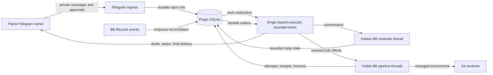
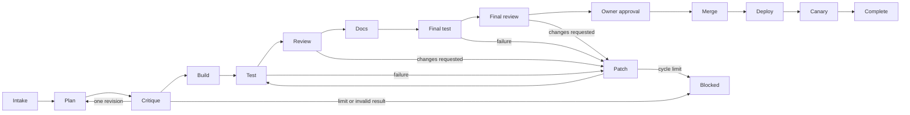

# Architecture

Telegram Agent is a full-trust BB plugin that turns one paired private Telegram chat into a durable controller for reviewed software delivery. Telegram is the operator interface; BB owns agent conversations, environments, worktrees, and merge execution; SQLite owns the plugin's recoverable control state.

## System model

The system has three layers:

1. **Telegram I/O** polls updates, validates the paired private owner, records accepted input, and delivers drafts, status edits, callbacks, and final messages.
2. **Durable control** stores pairing, controller turns, jobs, immutable policy snapshots, effects, approvals, attempts, liveness, and the Telegram outbox in the plugin database.
3. **BB execution** runs the hidden conversational controller and the visible planning, implementation, review, documentation, validation, merge, deployment, and canary work.

Ingress and BB lifecycle events do not start agent sessions. They record or enqueue work and nudge the executor. The single generation-fenced executor is the only component that dispatches controller turns, spawns pipeline threads, runs effects, or delivers Telegram output. Within that authority it can run a bounded number of independent project lanes concurrently.

## Ownership and data flow



The executor renews one authoritative lease heartbeat. A second instance may poll for the lease, but it cannot run a fenced effect or merge on behalf of the current generation. Lane concurrency does not create more executor authorities: each durable write and provider boundary remains fenced by the same owner and generation.

## Admissions and resource ownership

An admission is the durable scheduling record for a job:

- `queued` means the request is waiting for the global cap or its project claim;
- `admitted` means it occupies a concurrency slot and holds the project's pipeline claim;
- `draining` means terminal state is durable but authoritative worker/effect cleanup still owns the slot;
- `released` means cleanup completed and the slot and held claims no longer block later work.

The configured cap is global, but a unique held project claim permits only one admitted job per project. FIFO queue order decides between jobs for the same project; work from other free projects can fill the remaining slots.

Merge-time claims add two narrower exclusion boundaries. A normalized `repository_merge` claim serializes merges to the same GitHub repository. A configured production policy also takes a `production_target` claim; `production.targetKey` lets distinct projects name a shared target, while an omitted key falls back to the project id. Claims are acquired in the fenced merge lease transaction and exposed as bounded kind/key wait projections.

After an executor restart, the successor reconciles the exact job before adopting that job's held claims under its new generation. It never adopts another job's claims. A merge whose provider outcome may have started but is unknown retains its repository and production claims until provider truth is reconciled.

## Reviewed delivery pipeline



The planner writes a bounded plan artifact. The critic receives the work order and plan as immutable project attachments in a fresh BB thread. The implementation worker receives the accepted plan without inheriting the planner's provider conversation.

After implementation produces a pull request, deterministic validation runs before a fresh review thread is spawned in the same BB environment. A reviewer never forks or resumes the implementation conversation. A changes-requested verdict returns bounded findings to the implementation thread; a new pull-request head requires new validation and another fresh review.

Documentation, final validation, and final review happen before the owner receives a one-use merge approval. Merge, deploy, and canary each produce separate durable receipts. A successful merge followed by a failed deploy or canary is recorded as `production_failed`; the plugin does not claim completion or run rollback automatically.

## Controller trust kernel

The hidden controller has one answer source. `telegram_agent_respond` proposes a structured finalization, and only an accepted finalization becomes the controller response, conversation digest entry, and final Telegram outbox delivery. Raw provider message deltas are not answer content. The streaming path projects only fixed phase text — `Hanoon is queued…`, `Hanoon is connecting…`, `Hanoon is thinking…`, `Hanoon is using tools…`, `Hanoon is responding…`, `Hanoon completed.`, or `Hanoon failed.` — so a draft cannot leak provider prose.

An accepted finalization is bounded text plus optional claim segments. Each claim must cite evidence from the same turn; its subject must match exactly and its proof kind must be compatible with the claim. High-impact success statements cannot remain unclaimed prose. A process-only continuation is rejected. `answered` and `needs_owner` finalizations cannot carry obligation references. A `deferred` finalization must name a live durable obligation: a nonterminal job, an armed owner monitor, or an open sealed delegation with a running member. A `needs_owner` disposition must have an active owner boundary.

Evidence is projected into the turn with a high-water mark. The turn allows at most 128 evidence rows and eight finalization revisions. Hitting either bound fails closed. After a finalization is accepted, any later evidence, an exceeded evidence limit, or a lost lease/capability fence prevents completion and final delivery; it is not appended silently to the accepted answer.

### Hanoon-only controller manifest

The enforced Hanoon controller surface is exactly these 23 tools:

```text
telegram_agent_list_projects
telegram_agent_start_job
telegram_agent_job_status
telegram_agent_retry_job
telegram_agent_cancel_job
telegram_agent_list_threads
telegram_agent_thread_status
telegram_agent_read_thread
telegram_agent_create_thread
telegram_agent_send_to_thread
telegram_agent_request_thread_operation
telegram_agent_remember
telegram_agent_recall
telegram_agent_forget
telegram_agent_watch
telegram_agent_list_watches
telegram_agent_cancel_watch
telegram_agent_health
telegram_agent_delegate
telegram_agent_scorecard
telegram_agent_set_working_style
telegram_agent_turn_evidence
telegram_agent_respond
```

`telegram_agent_turn_evidence` reads the bounded evidence projection; `telegram_agent_respond` is the finalization boundary. The manifest is Hanoon-only: it does not expose a controller capability for connector installation, credential mutation or rotation, spending, destructive external action, or irreversible external write. Ordinary BB-native capabilities and opaque third-party provider actions remain outside this manifest and outside Hanoon's structured evidence boundary. They are residual risk governed by BB, the execution machine, and the provider rather than by an assumption that a provider session is proof.

The manifest and finalization contract do not change the delivery approvals. Merge still requires current review/validation evidence and the exact expiring one-use Telegram approval; deploy and canary still require their existing ordered receipts and terminal boundaries. No controller answer can claim those stages succeeded without same-turn durable evidence.

## Agent skill runtime

The BB manifest registers exactly three local skill roots, each vendored verbatim from one permissively licensed upstream and carrying that upstream's licence:

| Root | Upstream | Licence | Contents |
| --- | --- | --- | --- |
| `skills/workflow-kit` | [obra/superpowers](https://github.com/obra/superpowers), pinned `6.2.0` | MIT | 14 workflow skills |
| `skills/guards` | [amElnagdy/guard-skills](https://github.com/amElnagdy/guard-skills) | MIT | `clean-code-guard`, `test-guard`, `docs-guard` |
| `skills/delivery` | [getsentry/skills](https://github.com/getsentry/skills) | Apache-2.0 | `pr-writer` |

A root's licence is recorded per root rather than per bundle, because the three do not share one: folding Apache-2.0 material under an MIT notice would misstate its terms. All 18 catalog entries are committed in this repository, so the plugin has no runtime dependency on another skill plugin and never downloads a skill while starting a thread.

The existing single `bb.agents.configure` callback keeps the controller and worker boundaries separate. Its exact role-selection matrix is:

| Verified role/context | Selected skill ids |
| --- | --- |
| controller | none; controller tools and `CONTROLLER_INSTRUCTIONS` only |
| planner | none |
| critic | none |
| implementation | `systematic-debugging`, `test-driven-development`, `verification-before-completion`, `clean-code-guard`, `test-guard`, `pr-writer` |
| review | `clean-code-guard`, `test-guard` |
| documentation | `docs-guard`, `verification-before-completion` |
| final-review | `clean-code-guard`, `test-guard`, `docs-guard` |
| validation, merge, deploy, canary | none; these are deterministic stages, not skill-bearing worker roles |

### Fail-closed worker selection

The resolver first checks structural context. The origin must be non-fork (`origin.kind === null`) and belong to plugin `telegram-agent`; the project must be `standard`; and the environment must be a `managed-worktree`. The thread title must match the anchored production protocol exactly:

```text
Telegram <jobId> <role-token> <attemptId>
```

The parser accepts job ids of 1–256 `[A-Za-z0-9_-]` characters and attempt ids of 1–264 `[A-Za-z0-9_.:-]` characters. The only role tokens are `implementation`, `plan`, `critique`, `review`, `docs`, and `final-review`, mapped respectively to implementation, planner, critic, review, documentation, and final-review.

It then checks durable ownership. Implementation, review, and final-review titles must use an `attempt:` id and an exact durable attempt of kind `implementation` or `review`; planner, critic, and documentation titles must use a `stage:` id and an exact durable stage role `PLAN`, `CRITIQUE`, or `DOCS`. The id after that prefix is looked up as the exact job effect idempotency key, and its effect must be respectively `spawn_implementation`, `spawn_review`, `spawn_final_review`, `spawn_plan`, `spawn_critique`, or `spawn_docs`. The job must exist and belong to the current project. Its persisted environment id, when non-null, and persisted worker thread id, when non-null, must equal the current context. A null binding is allowed only for the first start; it is not a wildcard after persistence. Title, job, attempt, role, effect, project, environment, thread, origin, project-kind, or workspace mismatches all return no tools and no skills. There is no fallback to a newest job, parent thread, or title-only inference.

The controller branch is independently exact: it requires the active durable controller, matching project and host, the plugin origin, an allowed controller provider, a personal project and personal workspace, and the stable controller title. It receives controller tools and zero development skills. A spoofed or unrecognized context cannot inherit either controller tools or a worker profile.

### Bundle integrity and maintenance

`npm run skills:verify` runs the synchronous verifier used by activation. It requires the manifest roots and `skills/skills.lock.json` schema version 1, bounds the lock to 1 MiB, the bundle to 64 skills and 512 locked files, rejects symlinks/non-regular or over-256 KiB files, and requires every discovered file to be locked exactly once with a SHA-256 digest. It also checks lexical safe paths, skill directory/frontmatter/lock-name agreement, nested local Markdown links that stay within their registered root and resolve to a regular file or a directory inside it, and the recorded provenance and licence of all three roots (pinned workflow-kit `6.2.0`, the MIT guard kit, and the Apache-2.0 delivery kit) against their committed LICENSE files. Success prints a bundle digest and skill count.

The package `build` script runs `npm run skills:verify` before `bb plugin build`; `server.ts` runs the same verification before `createPlugin` can register services, tools, schedules, or commands. Any malformed lock, missing root/skill/resource, unlocked or escaped path, frontmatter/provenance mismatch, symlink, size/count limit, or digest mismatch stops the build or activation. There is no runtime download, replacement, or repair path.

Synchronization is a maintainer-only, network-free operation from an already-reviewed absolute checkout. The checkout must identify the `superpowers` package at version `6.2.0`, contain `LICENSE` and `skills/`, and carry the reviewed MIT license. The exact command is:

```bash
WORKFLOW_KIT_SOURCE=/absolute/path/to/superpowers-6.2.0
npm run skills:sync -- --source "$WORKFLOW_KIT_SOURCE" --version 6.2.0
```

It rewrites only the local `skills/workflow-kit` tree and `skills/skills.lock.json`; ordinary plugin startup never invokes it.

## BB threads and worktrees

BB threads and Git worktrees solve different isolation problems:

| Boundary | BB thread | Managed worktree |
| --- | --- | --- |
| Provider conversation | Isolated identity and history | Not applicable |
| Status and interactions | Durable per thread | Not applicable |
| Model, reasoning, and permissions | Resolved per turn/thread | Not applicable |
| Visibility and parent-child coordination | Owned by BB | Not applicable |
| Branch and checkout | References an environment | Owns the checkout |
| Uncommitted files and artifacts | Shared when threads reuse an environment | Isolated from other worktrees |
| Filesystem mutation | Runs through the thread's environment | The actual mutation boundary |

The conversational controller runs in a hidden personal workspace and has no implementation checkout. Planning creates or reuses the job's managed worktree. Implementation, review, documentation, and validation threads that reuse that environment see the same files, even though their provider conversations remain separate.

## Durable state

The plugin database records:

- one owner identity and expiring pairing codes;
- enabled project policies as immutable versioned snapshots;
- controller thread identity, FIFO turns, streaming cursors, and delivery state;
- every controller thread generation with its lifetime and the reason it was retired;
- a rolling conversation digest of answered turns;
- long-term memories with full-text search, supersession, and provenance;
- tool receipts keyed by turn, tool name, and argument hash;
- armed monitors, their trigger, and their firing history;
- watched threads with their last reported status, and the interactions offered to the owner with their answers and delivery state;
- jobs, queue admissions, resource claims, state-machine versions, stage attempts, and immutable handoff digests;
- idempotent effects and retry accounting;
- executor lease ownership and worker liveness;
- merge approvals, callback consumption, and production receipts;
- a durable Telegram outbox.

Restart recovery resumes from these records. It does not infer success from a missing process, stale provider output, or an HTTP success alone.

## Conversation continuity

A BB thread is one disposable execution generation serving a durable conversation. When a provider session fails, the thread is retired — recorded, not erased — and the next message opens a replacement seeded with:

- the recent conversation digest, so the owner is not asked to repeat themselves;
- the memories relevant to the new message;
- receipts for what the previous generation already did for that message.

Each answered turn writes its digest entry in the same transaction that records the answer, so a crash cannot leave a delivered reply that the next generation has no record of.

## Memory

Memories are typed (`preference`, `fact`, `decision`, `correction`), scoped to the owner globally or to one project, and ranked by a deterministic blend of BM25 relevance, recency decay, importance, and confidence. Ranking runs entirely inside SQLite through an FTS5 index: no embedding service, no API key, and no vector files to reconcile. A memory write commits in the same transaction as the row it indexes.

Restating a subject supersedes its predecessor instead of overwriting it, so corrections keep their history. Credential-shaped text is refused at the write, and the owner's explicit standing instructions ("always…", "never…", "remember that…") are captured at intake so they survive even if the answer itself fails.

## Monitors

A monitor is a durable obligation, not a reminder. It watches a BB thread for completion or failure, or fires on a cron schedule. Firing is claimed before it happens, so a crash mid-fire cannot double-book it; a one-shot watch retires and a schedule re-arms for its next occurrence. The agent receives its own instruction back as an ordinary turn, acts on it, and reports to the owner.

## Thread notices

A background sweep watches every **top-level** visible thread — a sub-agent's thread is reported to its parent, not to the owner — and delivers two things. Interactions that Hanoon can represent are bridged to Telegram; an unfamiliar or opaque BB interaction is reported without a guessed resolution and may still require the BB app.

- **Finished and failed.** A thread's first observation is recorded silently, so enabling the sweep does not replay a backlog. After that, only a thread that was *working* can stop working: a move into `idle` or `error` is announced when it comes from `active`, `starting`, or `stopping`. A thread marked failed after it already finished has had its say, and repeating it as a failure would contradict what the owner just read. A thread being steered turn by turn is announced at most once every ten minutes, so it does not narrate every reply.
- **Blocked.** A thread waiting on a BB interaction is rendered into Telegram with inline buttons: the options of a question, or the BB-supported approval choices for a command or file change. Visible worker notices may show *Allow once* / *Allow all session* / *Deny*. The hidden controller bridge is narrower: it offers only one-use *Allow once* / *Deny*. The tap is carried back through BB's interaction resolution, and delivery is recorded separately from the answer so a crash between the two re-sends rather than loses it.

Notices are written straight to the durable outbox rather than routed through the agent. They are a property of the plugin, not of the conversation, so they still arrive when the agent itself is the stuck part.

An interaction the plugin cannot render into buttons — an unfamiliar payload, or an approval whose subject it does not recognise — is reported without them, naming the thread and saying it needs the BB app. Guessing at a resolution would answer it wrongly; saying nothing would leave the thread waiting on an owner who was never told.

The sweep is paced independently of the executor loop it rides on, which polls as often as every 250ms while an answer streams. An owner's tap is delivered immediately; only the polling is paced.

## Controller questions

The conversational agent can ask the owner a question mid-answer. BB raises that as a pending interaction; the plugin detects it on the event stream, asks it in Telegram with inline options, and resolves it from a tap or a plain typed reply. Multi-question interactions are asked one at a time and resolved once every question is settled. Controller approval interactions are deliberately narrower than visible worker notices: the Telegram bridge accepts only one-use *Allow once* or *Deny*. While a turn is parked on a question or supported approval, the typing indicator stops because the turn is waiting on a person rather than composing.

The owner tap is persisted in `controller_interactions` before the exact BB interaction is resolved. On restart, recovery reads the answered interaction and retries the same resolution under its identity and fence; it does not invent a new approval or widen the decision. The older `controller_questions` table is migration history: migrations validate its pending/answered rows and copy their projections into `controller_interactions`, while active controller interaction state uses the newer table.

Two timeouts bound the ways an answer can go missing, and their ordering matters. A submitted turn that produces no BB event for eight minutes is treated as wedged: the turn fails with a message to the owner **and the thread is retired**, so the next message opens a fresh session. That deadline sits below the ten-minute limit on how long a queued message waits for a busy thread, so recovery happens before the queue starts failing behind it. A turn parked on a question is exempt — waiting on a person is not a stall.

A message the owner sends while an answer is still being written is steered into the running thread rather than queued behind it, so a correction lands while it can still correct something.

## Learning from finished jobs

Memory only grew when the agent chose to write something down, which meant it never learned the things it most needed: that a check always fails here for a known reason, that a repo enforces a convention, that work keeps going wrong in the same place.

A finished job is where those lessons live, so it is the one place the plugin spends inference of its own. When a job reaches a genuinely terminal outcome — merged, complete, blocked, or production-failed — it is enrolled for a single extraction. **`failed` is deliberately excluded: a failed job is still retryable, and a lesson drawn from an attempt that later succeeds is a wrong lesson.**

Enrolment scans for terminal jobs that have never been learned from rather than firing at the transition. That leaves the job state machine untouched and makes enrolment self-healing: a job finished during a restart is picked up on the next pass.

One extraction runs at a time, in a hidden thread on the job's own project, and is asked for strict JSON. Everything about the result is treated as untrusted: a fence or preamble is tolerated, a malformed entry costs that entry rather than the extraction, the cap counts usable lessons rather than attempts, and a lesson carrying credential-like text is refused by the ordinary memory guard. What survives is stored against the **project** scope — never the owner scope — at lower confidence than anything the owner said directly, because an extracted lesson is a guess about a pattern that has to earn its place by surviving.

## Keeping memory honest

Memory that only ever grows becomes memory that is mostly wrong, so two forces curate it, and neither needs a model.

**What the owner said next is the verdict on the last answer.** Every recall is linked to the turn it informed. When the owner's following message is a correction, exactly those memories lose confidence; when they move on, those memories gain a little. Demotion outweighs reinforcement, because being wrong in front of the owner is much stronger evidence than going unchallenged. A turn stays unscored until there *is* a next message — silence is not a verdict.

**Idle time ages out what was never useful.** Confidence decays on time since last recall rather than raw age, on a longer half-life than the ranking's, so a memory is never discarded faster than it is merely down-ranked. Only agent-written memories that were never recalled can be tombstoned; something the owner said out loud decays in confidence but never vanishes on a timer, and tombstoning sets `forgotten_at` rather than deleting.

A correction also retires the beliefs it contradicts. Two subjects contradict when one's words wholly contain the other's — "deploy on fridays" against "never deploy on fridays" — and only a `correction` may trigger it. A single shared word is a coincidence, and an ordinary restatement is not a refutation.

## Watching production

A canary runs once, immediately after a deploy. Between deploys nothing looks at production at all, which is how a crash loop runs for days while every job still reports green: the agent was watching its own work, not the thing its work produced.

A project policy may declare optional `healthCommands` — cheap, read-only checks, distinct from the canary because a canary is allowed to be neither. The executor runs them on `healthIntervalMs` (fifteen minutes by default) **without a model**, so a quiet week costs nothing but the commands themselves.

The agent is woken only when the answer changes. A single failure is a blip — a deploy in flight, a node restarting — so a fault is declared only after three consecutive failures, and one success clears the count. Crossing into failure wakes the agent once to investigate and tell the owner; recovery is reported once; everything in between is silence. The transition is claimed before the turn is enqueued, so a crash cannot report the same change twice, and a check that cannot be run at all is recorded as no evidence rather than as an outage.

## Self-maintenance

The plugin installs monitors it owns, keyed so installation is idempotent across restarts and exempt from the owner's armed-monitor cap: the agent's upkeep must not crowd out watches the owner set, nor consume slots they were counting on. They install on the first executor pass that finds a controller, because pairing can happen long after the plugin starts.

| Monitor | Cadence | Purpose |
| --- | --- | --- |
| `system-stale-jobs` | daily | Surface work that has stopped needing the agent and started needing a decision. |
| `system-memory-audit` | weekly | Re-judge the weakest memories and forget what is no longer true. |
| `system-autonomy-scorecard` | weekly | Report the durable scorecard. |

The first two are told to say nothing when nothing needs a person; upkeep that reports on quiet days trains the owner to ignore it. The scorecard is the deliberate exception, because it is a report rather than a sweep. Every figure it carries is read from committed state, so the agent can report what happened without inventing a rate the database cannot support.

## Controller delegation

A question often splits into independent pieces — different projects, different machines, different angles on one problem. Working through them in a single conversation is serial for no reason, and asking the agent to poll for its own subtasks turns every wait into wasted turns.

A delegation is a durable fan-out with a join. The controller opens up to four visible BB threads, each on its own managed worktree, and records them against one delegation row alongside the instruction it wrote to its future self. The delegation is written **before** any thread is spawned, so a failure partway through leaves threads that are still joined and reported rather than orphans nobody is waiting on. A spawn that fails after others have started returns a partial outcome and keeps watching the ones that did start; a spawn that fails first cancels the delegation and reports the error.

The monitor pass — which already turns durable obligations into controller turns — settles members as they land, capturing a clipped excerpt of each finished thread's output. When the last member settles, one turn is enqueued carrying the instruction and every result. The delegation is claimed before that turn is enqueued, so a crash mid-fire cannot replay it.

Two bounds keep the join honest:

- **Six hours.** A fan-out the owner is waiting on cannot hang on one wedged thread, so the join also fires on a deadline, describing any member still running rather than pretending it finished.
- **Withheld output.** Member summaries come from a shell the agent drove, which is a far wider exposure than the agent-authored text elsewhere in the system. A summary matching a credential shape — env-var assignments, key blocks, provider token prefixes — is replaced by a withheld marker instead of being stored and replayed into a later prompt.

At most two delegations are open per controller, and at most four threads each: eight threads is already more than one owner can follow in a chat.

## Working style

The fixed instructions are code-owned, but how the owner wants the agent to *work* — terser answers, always lead with the PR link — is theirs, and should not need a release. A single bounded overlay is stored durably and rendered after the fixed instructions on every turn, never before them, so it can adjust tone and habits but cannot argue its way past a boundary stated above. It is replaced wholesale rather than appended to, refused if it carries credential-like text, and cleared by setting it empty.

Background learning runs on its own model setting, defaulting to `inherit`. Extraction reads a repository and writes three sentences; it does not need the owner's conversational tier. `inherit` is the default because a model this installation's providers do not offer would fail every extraction.

## Controller supervision

The stall clock only catches a turn that goes silent. A turn that keeps producing events while getting nowhere is invisible to it, so the controller's tool, token, command-failure, and completion-continuation limits provide the other bounds.

The reconcile loop already pages the BB event stream to redraw the Telegram draft. It now also counts what that stream reveals: tool-shaped item starts, non-zero command exits, and the cumulative token total. Those land on the turn row inside the same cursor-guarded update that advances the draft, so a replayed page cannot count twice.

A submitted turn is then judged against two kinds of budget:

- Crossing a **soft** budget — tool calls, tokens, or repeated command failures — spends one of two available nudges, steered into the running thread. Each reason may nudge only once: a tripped budget stays tripped on every later poll, so without that guard one crossing would nudge forever. A nudge that fails to deliver is not fatal; the hard budget still applies.
- Crossing a **hard** budget — tool calls or tokens — fails the turn with a short message to the owner **and retires the thread**, matching the stall path. Retiring is the half that matters: a turn stopped for cost that left its thread alive would let the next message resume the same loop.

The owner's own words outrank a budget nudge, so supervision runs only when nothing they sent is waiting to be steered. A turn parked on a question is exempt entirely — no budget should fire against a person's thinking time.

Budgets are constants rather than settings, on the same reasoning as the stall deadline: they are safety backstops well above any healthy turn, not a knob the owner should have to tune from a phone.

## Safety properties

- Exactly one private Telegram user/chat identity is paired. Multiple independent projects may be admitted up to the configured bound, but each project pipeline is serialized.
- Fresh or unset controller settings resolve to `auto`; explicit saved permission values are preserved. Supported BB-native controller approvals reach Telegram as one-use *Allow once* / *Deny*, while BB and the execution machine continue to enforce their limits. The Hanoon manifest does not itself grant connector installation, credential mutation, spending, destructive external action, or irreversible external write capabilities.
- Reviewed code work goes through the job pipeline. The agent creates durable job intent through registered tools; it cannot spawn pipeline workers or touch a worktree directly.
- A mutating tool call runs at most once per turn for identical arguments. A call interrupted mid-flight is reported to the agent as an uncertain outcome to verify, never silently retried.
- Memory never stores credential-shaped text, and hidden threads stay unreachable from the thread tools.
- Project worker settings come from the job's immutable project policy. Changing the controller model or reasoning level does not rewrite an active job.
- Review verdicts are structured and bound to an exact full pull-request head SHA.
- Pull-request head evidence is resolved from `git ls-remote origin refs/pull/<number>/head`; cached API metadata is not the merge authority.
- Merge requires current review and validation evidence plus an expiring, one-use owner approval. Concurrency and resource ownership never replace that approval, and GitHub repository rules still apply.
- Deployment and canary commands are owner-authored policy inputs. They run only after the approved merge is confirmed and the worktree is detached at that merge commit.
- Tokens, pairing links, callback nonces, raw private messages, and credential-like command output are excluded from normal evidence and documentation.

See [Configuration](configuration.md) for the operator-controlled inputs and [Operations](operations.md) for recovery behavior.
