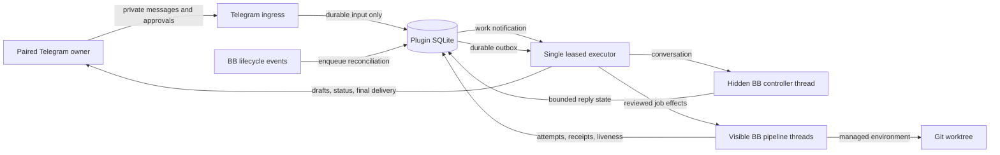
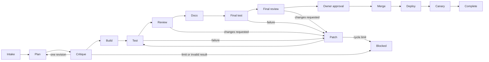

# Architecture

Telegram Agent is a full-trust BB plugin that turns one paired private Telegram chat into a durable controller for reviewed software delivery. Telegram is the operator interface; BB owns agent conversations, environments, worktrees, and merge execution; SQLite owns the plugin's recoverable control state.

## System model

The system has three layers:

1. **Telegram I/O** polls updates, validates the paired private owner, records accepted input, and delivers drafts, status edits, callbacks, and final messages.
2. **Durable control** stores pairing, controller turns, jobs, immutable policy snapshots, effects, approvals, attempts, liveness, and the Telegram outbox in the plugin database.
3. **BB execution** runs the hidden conversational controller and the visible planning, implementation, review, documentation, validation, merge, deployment, and canary work.

Ingress and BB lifecycle events do not start agent sessions. They record or enqueue work and nudge the executor. The single generation-fenced executor is the only component that dispatches controller turns, spawns pipeline threads, runs effects, or delivers Telegram output.

## Ownership and data flow

The executor renews one authoritative lease heartbeat. A second instance may poll for the lease, but it cannot run a fenced effect or merge on behalf of the current generation.

## Reviewed delivery pipeline

The planner writes a bounded plan artifact. The critic receives the work order and plan as immutable project attachments in a fresh BB thread. The implementation worker receives the accepted plan without inheriting the planner's provider conversation.

After implementation produces a pull request, deterministic validation runs before a fresh review thread is spawned in the same BB environment. A reviewer never forks or resumes the implementation conversation. A changes-requested verdict returns bounded findings to the implementation thread; a new pull-request head requires new validation and another fresh review.

Documentation, final validation, and final review happen before the owner receives a one-use merge approval. Merge, deploy, and canary each produce separate durable receipts. A successful merge followed by a failed deploy or canary is recorded as `production_failed`; the plugin does not claim completion or run rollback automatically.

## BB threads and worktrees

BB threads and Git worktrees solve different isolation problems:

| Boundary | BB thread | Managed worktree |
| --- | --- | --- |
| Provider conversation | Isolated identity and history | Not applicable |
| Status and interactions | Durable per thread | Not applicable |
| Model, reasoning, and permissions | Resolved per turn/thread | Not applicable |
| Visibility and parent-child coordination | Owned by BB | Not applicable |
| Branch and checkout | References an environment | Owns the checkout |
| Uncommitted files and artifacts | Shared when threads reuse an environment | Isolated from other worktrees |
| Filesystem mutation | Runs through the thread's environment | The actual mutation boundary |

The conversational controller runs in a hidden personal workspace and has no implementation checkout. Planning creates or reuses the job's managed worktree. Implementation, review, documentation, and validation threads that reuse that environment see the same files, even though their provider conversations remain separate.

## Durable state

The plugin database records:

- one owner identity and expiring pairing codes;
- enabled project policies as immutable versioned snapshots;
- controller thread identity, FIFO turns, streaming cursors, and delivery state;
- every controller thread generation with its lifetime and the reason it was retired;
- a rolling conversation digest of answered turns;
- long-term memories with full-text search, supersession, and provenance;
- tool receipts keyed by turn, tool name, and argument hash;
- armed monitors, their trigger, and their firing history;
- jobs, state-machine versions, stage attempts, and immutable handoff digests;
- idempotent effects and retry accounting;
- executor lease ownership and worker liveness;
- merge approvals, callback consumption, and production receipts;
- a durable Telegram outbox.

Restart recovery resumes from these records. It does not infer success from a missing process, stale provider output, or an HTTP success alone.

## Conversation continuity

A BB thread is one disposable execution generation serving a durable conversation. When a provider session fails, the thread is retired — recorded, not erased — and the next message opens a replacement seeded with:

- the recent conversation digest, so the owner is not asked to repeat themselves;
- the memories relevant to the new message;
- receipts for what the previous generation already did for that message.

Each answered turn writes its digest entry in the same transaction that records the answer, so a crash cannot leave a delivered reply that the next generation has no record of.

## Memory

Memories are typed (`preference`, `fact`, `decision`, `correction`), scoped to the owner globally or to one project, and ranked by a deterministic blend of BM25 relevance, recency decay, importance, and confidence. Ranking runs entirely inside SQLite through an FTS5 index: no embedding service, no API key, and no vector files to reconcile. A memory write commits in the same transaction as the row it indexes.

Restating a subject supersedes its predecessor instead of overwriting it, so corrections keep their history. Credential-shaped text is refused at the write, and the owner's explicit standing instructions ("always…", "never…", "remember that…") are captured at intake so they survive even if the answer itself fails.

## Monitors

A monitor is a durable obligation, not a reminder. It watches a BB thread for completion or failure, or fires on a cron schedule. Firing is claimed before it happens, so a crash mid-fire cannot double-book it; a one-shot watch retires and a schedule re-arms for its next occurrence. The agent receives its own instruction back as an ordinary turn, acts on it, and reports to the owner.

## Safety properties

- Exactly one private Telegram user/chat identity is paired, and only one job may be active.
- The agent runs with full permissions and may use the shell, the `bb` CLI, skills, and MCP servers; it cannot approve a merge or merge code, which stay behind a one-use Telegram approval.
- Reviewed code work goes through the job pipeline. The agent creates durable job intent through registered tools; it cannot spawn pipeline workers or touch a worktree directly.
- A mutating tool call runs at most once per turn for identical arguments. A call interrupted mid-flight is reported to the agent as an uncertain outcome to verify, never silently retried.
- Memory never stores credential-shaped text, and hidden threads stay unreachable from the thread tools.
- Project worker settings come from the job's immutable project policy. Changing the controller model or reasoning level does not rewrite an active job.
- Review verdicts are structured and bound to an exact full pull-request head SHA.
- Pull-request head evidence is resolved from `git ls-remote origin refs/pull/<number>/head`; cached API metadata is not the merge authority.
- Merge requires current review and validation evidence plus an expiring, one-use owner approval. GitHub repository rules still apply.
- Deployment and canary commands are owner-authored policy inputs. They run only after the approved merge is confirmed and the worktree is detached at that merge commit.
- Tokens, pairing links, callback nonces, raw private messages, and credential-like command output are excluded from normal evidence and documentation.

See [Configuration](configuration.md) for the operator-controlled inputs and [Operations](operations.md) for recovery behavior.
