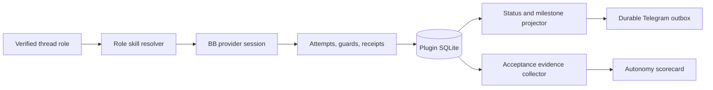

# Agent Experience and Proven Autonomy Design

Capability-routing amendment: [Adaptive Capability Pipeline Specification](adaptive-capability-pipeline.md). That specification supersedes this document's static role-to-skill mapping, skill-only receipt schema, and associated rollout and acceptance wording. The Telegram experience and live-acceptance contracts here remain authoritative where the amendment does not replace them.

Implementation status (2026-08-13): the 23-skill bundle, universal profiles and receipts, least-capability controller bundles, strict guard outcomes, model trials, six recipe graphs, fake-host acceptance, bounded operator projections, and fail-closed promotion reader are implemented. The trusted disposable-live promotion collector and CLI-managed acceptance session described below are not implemented. Live recipe promotion is therefore `not run/incomplete`; a fresh installation starts every adaptive recipe in `shadow`.

## Purpose

This design makes the Telegram agent easier to trust and more capable without weakening its existing admission, review, approval, merge, or production fences. It adds a self-contained skill bundle, evidence-backed progress communication, and an executable live acceptance system.

The plugin remains the authority for durable state. Skills guide worker behavior; they do not decide whether a job may advance, merge, deploy, or claim completion.

## Goals

- Ship the agent with the development workflow and quality skills it needs.
- Load only the capabilities selected for the current verified profile.
- Make Telegram updates concise, timely, and based on durable facts.
- Continue autonomous work while the state machine has a safe next action.
- Pause only for an owner decision, an explicit policy boundary, or a proved blocker.
- Turn real Telegram, BB, GitHub, restart, and concurrency behavior into repeatable acceptance evidence.
- Measure autonomy using completed work and interventions, not model narration.

## Non-goals

- Replacing the durable job state machine with an agent-managed workflow.
- Giving the conversational controller access to implementation worktrees.
- Allowing skills or prompts to approve, merge, deploy, or bypass policy.
- Loading every bundled skill into every provider session.
- Copying another agent's product identity, repository-specific policy, or prompts.
- Writing internal planning artifacts to `.superpowers/` or `docs/superpowers/`.
- Adding hosted CI, automatic pushes, or automatic production rollback.

## Design principles

1. **Durable state over narration.** User-visible claims come from jobs, attempts, receipts, liveness, outbox delivery, and provider results.
2. **Minimum context by role.** Each provider session receives the smallest skill and tool set needed for its contract.
3. **One owner-facing status.** A job keeps one editable status message; important milestones may add concise, idempotent notices.
4. **Promises are persisted.** Follow-up behavior is implemented by durable job notices or monitors, not conversational assurances.
5. **Independent judgment.** Review workers do not inherit implementation conversation history and do not receive implementation authority.
6. **Live evidence is a separate proof class.** Deterministic tests cannot stand in for Telegram, provider, GitHub, deployment, or restart evidence.

## Architecture

The change has three cooperating layers:



The existing executor remains the single generation-fenced authority. Skill selection happens when BB resolves a plugin-owned thread. Worker results are persisted through the existing attempt, effect, validation, review, and outbox boundaries.

## Self-contained skill bundle

### Packaging

The plugin will change `package.json` from `"skills": []` to a plugin-owned skill root. The bundle contains:

- a pinned development workflow kit with its redistribution license;
- `clean-code-guard`;
- `test-guard`;
- `docs-guard`;
- a machine-readable lock file containing source version, digest, license, and registered frontmatter name for every bundled skill.

Only material with clear redistribution rights is copied verbatim. Where a locally installed guard has no redistribution license, the plugin ships an independently written guard with the same purpose and observable contract.

The plugin does not download or update skills at runtime. A maintainer-only synchronization command updates the vendored source, lock file, and license inventory. A deterministic check rejects missing files, digest drift, duplicate frontmatter names, or role references to unknown skills.

### Role resolution

One pure resolver extends the existing `bb.agents.configure` callback. A worker role is accepted only when all available structural evidence agrees:

- the thread origin belongs to this plugin;
- the project and workspace type match the role;
- the title matches an anchored job-role pattern;
- on later turns, the durable attempt owns the exact thread id.

A spoofed title, unrelated thread, unknown role, or identity mismatch resolves to no tools and no skills. The hidden controller keeps its existing exact authorization and receives no development skills.

### Historical role matrix

The table below records the earlier static design and is superseded by the amendment's profile selector. The implemented matrix is documented in [Architecture](../architecture.md#agent-skill-runtime); it adds the shared human-communication guidance, manual controller discovery skills, and recipe/stage-specific selections without loading every skill.

| Worker role | Selected skills | Reason |
| --- | --- | --- |
| Controller | none | Keep phone conversation fast; code changes remain tool-routed into jobs. |
| Planner | none from the generic kit | The immutable planning packet already defines a non-interactive output contract. |
| Critic | none from the generic kit | Preserve independent, strict critique output. |
| Implementation and remediation | systematic debugging, test-driven development, verification, clean-code guard, test guard | Reproduce failures, implement with evidence, then review changed production and test code. |
| Review | clean-code guard, test guard | Inspect the exact diff and tests without implementation authority. |
| Documentation | docs guard, verification | Verify documentation against the reviewed code and report bounded evidence. |
| Final review | clean-code guard, test guard, docs guard | Re-check the final head across code, tests, and documentation. |
| Validation, merge, deploy, canary | none | These stages are deterministic commands and fenced storage operations. |

The full pinned workflow kit may be packaged for future profiles, but only the tested matrix is selected by default. A new role-to-skill mapping requires a resolver test and a live acceptance observation before release.

### Skill execution evidence

The plugin creates a bounded selection receipt when it spawns an attempt. A mandatory guard updates that receipt only after the executor parses the worker's strict guard-result contract. The receipt records:

- attempt id and job id;
- skill id and bundle digest;
- selection reason;
- start and finish timestamps;
- outcome: `selected`, `passed`, `findings`, `blocked`, `failed`, or `not_applicable`;
- bounded finding counts by severity;
- verification commands and exit outcomes where applicable.

Raw prompts, unrestricted logs, credentials, and unbounded model output are not stored. Guard findings use the existing review-style bounded evidence model. A selected workflow skill may remain `selected`; mandatory guards must produce a terminal receipt before their stage can advance.

Blocking guard findings return to remediation. Findings are fingerprinted from normalized severity, file, line, title, and details. The same unchanged fingerprint may trigger remediation at most twice; a third recurrence blocks the job with the repeated evidence. Warnings remain visible but do not create an infinite patch loop.

## Prompt and harness improvements

### One prompt composition path

Controller instructions are resolved once through `bb.agents.configure`. The initial controller message contains the owner message and bounded replacement context, not a second copy of the full instructions. This gives provider sessions a stable instruction prefix and removes two sources of drift.

Worker prompts stay small and attachment-first. The immutable work order or review packet remains the source of job authority. Dynamic instructions contribute only the verified role, selected skill ids, response contract, and the rule that durable job policy outranks skill suggestions.

### Safe autonomous continuation

Continuation follows durable state rather than phrases such as “done” or “I will continue.” The executor continues while at least one of these is true:

- a fenced effect is runnable;
- a worker lane has live activity;
- a known retry is due;
- a remediation or review transition created a new attempt;
- an owner-independent monitor or delivery obligation is due.

It pauses when:

- an owner approval or answer is required;
- a policy limit is reached;
- the same blocker recurs without new evidence;
- required external configuration is absent;
- the state is terminal.

The existing executor wake mechanism is the single continuation signal. New actions persist work before waking it.

## Telegram user experience

### Status card

The existing logical status message remains the canonical job view. It gains a compact, consistently ordered summary:

1. current stage and project;
2. queue position or resource wait when applicable;
3. current worker activity and observation age;
4. last completed milestone with evidence count;
5. blocker or required owner action;
6. only the actions valid for the current durable state.

The renderer never presents an action after that action was requested or consumed. Every edit is persisted before delivery and remains recoverable after restart.

### Milestone notices

The plugin sends separate notices only for events that materially change what the owner needs to know:

- job admitted after waiting;
- implementation started;
- review requested changes;
- job blocked or failed;
- approval ready;
- merge confirmed;
- production failed;
- job completed or cancelled.

Each notice uses a logical key containing job id and job version, so replay cannot duplicate it. Intermediate state changes update the status card without creating chat noise.

### Response quality

Controller answers lead with the outcome and omit tool narration. The completion gate compares the final reply with that turn's tool receipts, durable mutations, and substantive answer text. A response that contains only intent to investigate is not delivered as a finished answer; the controller turn remains active and receives one continuation instruction. An answer may promise later follow-up only when the job pipeline or a durable monitor already owns that obligation.

The delivery layer does not invent results or silently rewrite technical conclusions. It may request one bounded rewrite for Telegram formatting or missing outcome-first structure. If the rewrite fails, it delivers a concise failure notice and keeps the underlying turn evidence.

### Natural control

Natural-language status, cancellation, retry, and steering continue through controller tools and exact job identities. Ambiguous requests return bounded choices. A reply to a job status message remains the strongest implicit job selection signal.

## Executable live acceptance

### Proposed acceptance session

A future slice may add a CLI-managed acceptance session with durable state:

```text
bb telegram-agent acceptance start --profile <profile-file>
bb telegram-agent acceptance show <run-id> --json
bb telegram-agent acceptance continue <run-id>
bb telegram-agent acceptance verify <run-id> --json
```

The profile names only disposable projects, repositories, branches, production targets, and commands. The start command refuses a non-disposable profile, records a bounded evidence checklist, and sends the owner the next required Telegram action. `continue` re-reads authoritative state; it never marks a step complete from a typed assertion. `verify` reports `passed`, `failed`, or `incomplete` with proof classes kept separate.

The current release instead provides the manual [Disposable live acceptance](../live-acceptance.md) runbook. No acceptance-runner command is registered. A future runner must coordinate owner taps and messages without impersonating the Telegram owner or bypassing merge approval.

### Required scenarios

One release acceptance run covers:

1. real Telegram ingress and controller reply;
2. profile-specific capability resolution on real BB threads;
3. a queued cancellation, status edit, and capacity release;
4. two independent jobs progressing concurrently;
5. same-project serialization;
6. provider interruption and exact restart recovery;
7. implementation, validation, independent review, remediation, and fresh-head review;
8. stale approval rejection;
9. one approved merge and disposable deployment/canary execution;
10. failed Telegram delivery followed by durable redelivery without duplicate irreversible effects.

Tests that do not mutate GitHub or a disposable target remain a separate deterministic gate. A partial live run is `incomplete`, never `passed`.

### Autonomy scorecard

The acceptance report and operational health output expose:

- jobs completed, blocked, failed, and cancelled;
- owner decisions requested;
- unexpected owner interventions;
- remediation cycles;
- executor or provider recoveries;
- duplicate irreversible effects, which must remain zero;
- unsupported success claims, which must remain zero;
- Telegram delivery retries and terminal failures;
- median queue-to-start and stage durations, calculated only from durable timestamps.

No synthetic percentage is shown for an individual running job. Aggregate rates are reported only when the denominator and time window are present.

## Persistence changes

Capability selection and outcomes use the universal profiles and append-only receipts defined by the [Adaptive Capability Pipeline Specification](adaptive-capability-pipeline.md). A read-only `skill_receipts` compatibility view preserves bounded earlier consumers; it is not a second evidence authority.

### `acceptance_runs`

One row per disposable live run, with a bounded JSON evidence projection, current step, status, profile digest, and timestamps. Secret settings, raw private messages, and raw provider output are excluded.

Milestone notices reuse the existing outbox and job version. No separate notification table is required.

## Failure handling

- Missing or corrupt bundled skills fail plugin activation with the exact skill id.
- Unknown or spoofed worker roles receive no plugin skills.
- A guard crash fails its worker attempt and follows the existing bounded attempt/effect retry policy.
- A guard cannot directly change job state; only fenced executor transitions consume its result.
- Repeated unchanged blocking findings stop remediation instead of oscillating.
- A failed milestone delivery remains in the durable outbox.
- An acceptance runner restart resumes from `acceptance_runs` and re-verifies the current world.
- A live scenario with missing evidence remains `incomplete`.

## Testing strategy

### Deterministic tests

- Manifest and lock-file tests verify every registered skill name, digest, license entry, and referenced file.
- Data-driven resolver tests cover controller, every worker role, spoofed titles, wrong origins, wrong projects, wrong workspaces, stale thread ids, and unknown roles.
- Prompt tests prove one controller instruction copy and stable role instruction composition.
- Real SQLite tests cover universal capability receipt idempotency, bounds, replay, compatibility views, and failure persistence.
- Runner tests assert that existing thread titles and structural identities still map to the intended roles.
- Telegram tests cover status ordering, valid buttons, milestone deduplication, process-only response continuation, and promise ownership.
- Acceptance-runner tests use real migrated SQLite and fake only Telegram, provider, GitHub, and command boundaries.
- Existing admission, executor, review, merge, production, and end-to-end suites remain green.

### Live tests

The executable acceptance session is the live test. It uses the real installed plugin, real Telegram bot, real BB providers and worktrees, a disposable GitHub repository, and disposable production commands. The final report links each conclusion to identifiers, digests, statuses, or bounded receipts.

## Rollout

1. Bundle and role-route skills without changing job progression.
2. Persist universal capability profiles and receipts and enforce guard remediation bounds.
3. Remove duplicate controller prompt composition and add response-quality continuation.
4. Add status-card ordering and idempotent milestone notices.
5. Add acceptance sessions and scorecards.
6. Run deterministic gates, rebuild and reload the plugin, then complete one disposable live acceptance run.

Each step is independently reversible before the live run. Database migrations are append-only. The merge approval and production claim contracts do not change.

## Acceptance criteria

- The plugin installs with its skill bundle and no external skill plugin dependency.
- Every plugin-owned thread resolves exactly its tested capability profile; unrelated threads resolve none.
- The controller receives no development skills and no duplicate instruction block.
- Implementation, review, documentation, and final-review attempts persist bounded universal capability outcomes.
- Guard findings cannot bypass the state machine or create an unbounded remediation loop.
- Telegram status actions always match durable state, and milestone notices are replay-safe.
- Process narration alone cannot terminate a controller turn.
- Every promised follow-up has a durable job or monitor owner.
- The deterministic suite, typecheck, build, and bundle integrity check pass.
- One disposable live acceptance run covers all required scenarios and ends `passed` with zero duplicate irreversible effects and zero unsupported success claims.
- No internal planning directory or prohibited comparison identifier is tracked.
