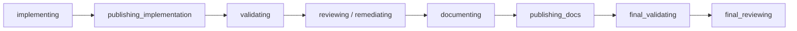

# Hanoon agent reliability recovery design

Status: approved for implementation planning

Date: 2026-08-12

Design baseline: `85d31954e94c65c0e8fe1409565ce123919d991d`

Related design: [Hanoon agent operating system](../../designs/hanoon-agent-operating-system.md) and [research review](../../designs/hanoon-agent-operating-system-research.md)

## Decision

Hanoon will recover reliability by making observation order, job ownership, workflow continuation, publication, and owner communication explicit durable protocols. BB remains responsible for provider sessions, threads, environments, worktrees, and host execution. The plugin remains the authority for jobs, fences, claims, effects, receipts, controls, and Telegram delivery in SQLite.

Model workers may inspect, edit, and test only within their role. They never commit, push, create or adopt a pull request, merge, deploy, or mutate durable job state. A generation-fenced executor performs deterministic publication through a registration-owned adapter. Internal work stays hidden and is classified by durable provenance. Silence is a validated completion available only to two named system monitors; every other owed communication remains visible.

## Problem and evidence

The baseline has sound transactional primitives, but several boundaries are incomplete or contradictory:

| Evidence in the committed baseline | Reliability consequence |
| --- | --- |
| [`src/bb/terminal-command.ts`](../../../src/bb/terminal-command.ts) can return on a result marker, timeout, or abort after closing the terminal without first emitting an absorbing terminal observation. | A successful or stopped command can remain durably active and retain a project slot. |
| [`src/services/worker-liveness.ts`](../../../src/services/worker-liveness.ts) gives sequential validation terminals the same role-derived generation and orders same-generation updates by observer time. | Delayed observations can overwrite newer source truth, and one validation command can be confused with the next. |
| Reconciliation in [`src/plugin.ts`](../../../src/plugin.ts) reads thread metadata but not timeline activity before treating `idle` as completion. | An idle foreground turn can be advanced while a background command, workflow, goal, or plan is still live. An old `updatedAt` can be mistaken for death. |
| [`src/bb/handoffs.ts`](../../../src/bb/handoffs.ts) tells the delivery workflow to commit, push, and create a pull request, while role prompts in [`src/bb/runner.ts`](../../../src/bb/runner.ts) prohibit those actions for some roles and require them for docs. | Planner, critic, builder, and docs workers receive incompatible ownership instructions. |
| [`src/domain/state-machine.ts`](../../../src/domain/state-machine.ts) uses `review_limit` for both plan critique exhaustion and code-review exhaustion, while `CONTINUE_REVIEW` always resumes review. | A planning failure can expose an impossible review continuation. |
| [`src/services/effect-runner.ts`](../../../src/services/effect-runner.ts) expects a worker-created pull request, while [`src/services/merge-handler.ts`](../../../src/services/merge-handler.ts) already has the stronger pattern: mark an external call unknown, fence it, and reconcile authoritative state. | Publication is model-owned and split-brain, although merge is already receipt-owned and replay-safe. |
| [`src/autonomy/models.ts`](../../../src/autonomy/models.ts) excludes `failed` from release candidates, and retry paths in Telegram and controller ingress apply `RETRY` directly. | Failed jobs can hold a project indefinitely, while retry can start work before admission reacquires the project. |
| [`src/services/thread-notice-service.ts`](../../../src/services/thread-notice-service.ts) classifies visible root threads without durable role provenance and deduplicates by status plus time. | Internal workers can appear as owner work; a title can mislead classification; genuine later cycles can be suppressed or replays repeated. |
| [`src/services/monitor-service.ts`](../../../src/services/monitor-service.ts) records monitor/delegation advancement separately from turn enqueue and always asks for a message. | A crash can consume an obligation without a turn, and healthy monitors cannot settle quietly. |

The design adapts five useful Valor patterns recorded by the approved audit at Valor commit `a13a31a083746d0c66e8cba17b84fea82c8b8096`: combine multiple positive liveness signals, give each run an explicit identity, renew ownership explicitly, advance monotonic cursors, revalidate authority immediately before mutation, and reread remote state authoritatively after uncertain calls. It does not copy Valor's process, Redis, bridge, or provider-runner topology.

The external basis is equally narrow. Kubernetes Leases separate holder identity, duration, and renewal rather than treating age as an ownership transfer ([Kubernetes Leases](https://kubernetes.io/docs/concepts/architecture/leases/)). The transactional outbox pattern requires the state change and durable work record to commit together and assumes duplicate delivery must be idempotent ([AWS transactional outbox](https://docs.aws.amazon.com/prescriptive-guidance/latest/cloud-design-patterns/transactional-outbox.html)). GitHub's pull-request list API supports exact `head` and `base` filters, while creation requires explicit `head`, `base`, and repository identity ([GitHub list pull requests](https://docs.github.com/en/rest/pulls/pulls?apiVersion=2022-11-28#list-pull-requests), [GitHub create a pull request](https://docs.github.com/en/rest/pulls/pulls?apiVersion=2022-11-28#create-a-pull-request)). SQLite serializes writes across connections, so immediate transactions plus uniqueness constraints can enforce the selected winner ([SQLite isolation](https://www.sqlite.org/isolation.html)).

All numeric bounds in this document are product policy, not limits derived from Kubernetes, AWS, GitHub, SQLite, Valor, or another standard. Changing one requires an explicit policy and test change.

## Goals

1. Make worker completion and liveness monotonic, replay-safe, and independent of observer wall-clock order.
2. Keep one project owner until fenced cleanup proves that the owner has no live worker or unresolved external outcome.
3. Give each role one coherent artifact contract and give planning and review distinct exhaustion/resume semantics.
4. Publish implementation and documentation changes through one deterministic, receipted commit/push/pull-request saga.
5. Hide internal work without losing genuine owner obligations, later thread cycles, or failure reports.
6. Cut managed-job mutation authority over only after guarded native capabilities cover the workflow and rollback is proven.
7. Make every rule testable with a fake BB host, real temporary SQLite, authoritative boundary fakes, and two-connection races.

## Non-goals

- Replacing BB's thread, environment, worktree, provider, host, or interaction ownership.
- Adding another workflow engine, queue, database, distributed lock service, or model-based liveness judge.
- Letting model prose prove a terminal result, pull request, remote head, owner notification, or resource release.
- Force-pushing, rewriting an unexpected branch, adopting a mismatched pull request, or automatically resolving external conflicts.
- Migrating an already persisted controller permission setting during this work.
- Mutating live jobs, a live plugin database, a live repository ref, or a live pull request while implementing or testing this design.
- Reconciling any historical production incident as part of the implementation changes.

## Invariants

1. **One absorbing terminal.** Every `TerminalCommandRunner` run emits exactly one terminal outcome. The runner records and awaits that emission before force-close and before resolving or rejecting its caller. Later marker, timeout, abort, output, or status events cannot change it.
2. **Source order wins.** Terminal-run callbacks use `(generation, lifecycleOrder)`. A negative BB thread observation is actionable only from a BB-native atomic activity snapshot, or a versioned multi-call protocol whose host attestation guarantees that every relevant status, activity, and interaction change advances one shared revision. Local single-flight and `timeline.maxSeq` alone do not create that guarantee. A complete attested snapshot receives its `observationOrder` only afterward; lower revisions are stale and equal revisions must be identical replays. Without the capability, positive activity may conservatively block idle, but absence of activity is `unknown`.
3. **One run, one generation.** Each stage attempt and each individual terminal command has a stable `runId` and a distinct generation. Sequential validation, final-validation, deploy, and canary commands never reuse a generation.
4. **No negative inference from age.** An old `thread.updatedAt` is diagnostic only. Host reconnect and incomplete reads are `unknown`. `idle` is actionable only after metadata, timeline, background counts, prompt/goal state, and pending interactions agree there is no live work.
5. **Claims are explicit ownership.** A held claim remains held regardless of lease age. Every executor acquisition pass refreshes all held project claims under that executor's current fence. Only fenced cleanup releases a claim.
6. **Admission precedes execution.** Confirmation, planning continuation, remediation continuation, legacy review continuation, and retry are admission resume events. The transaction that admits the event also acquires the project claim and applies the state-machine event; no work effect exists before both succeed.
7. **Artifacts are role-scoped.** A worker can write only its declared artifact or workspace surface. No common handoff tells a role to perform an action its role contract forbids.
8. **Publication is executor-owned and capability-gated.** Model workers never publish. Commit, push, and pull-request creation occur only through the fenced publication saga and its registration-owned adapter. `executor_v2` remains disabled unless BB exposes a runtime-attested conditional commit primitive that atomically checks the expected repository head and candidate tree under a deterministic request key.
9. **Unknown precedes mutation.** Before every external publication mutation, one immediate SQLite transaction revalidates executor/effect/job/environment identity, records the exact mutation input, and marks the step `unknown`. Replay performs authoritative reads before another call.
10. **Unknown retains ownership.** A publication step with an unresolved external outcome is not generic-dead-lettered and cannot release the project slot.
11. **One policy for controls.** Telegram rendering, controller projection, and every ingress/tool validation call the same pure `availableJobControls` policy over the same durable snapshot.
12. **Provenance, never title.** Worker visibility and notice classification use durable registration and BB origin metadata. Titles are display text only.
13. **Obligation and enqueue are atomic.** Monitor advance plus controller-turn enqueue, and delegation join plus controller-turn enqueue, each commit in one transaction.
14. **Silence is a completion, not missing output.** Only an allowlisted `system_monitor` turn with `deliveryRequirement=conditional` can settle silently. Accepted silence creates neither Telegram outbox nor conversation digest but does settle the turn and its communication obligation.
15. **Visible failure is owed until sent.** A missing, malformed, rejected-after-continuation, or failed completion produces one idempotent logical failure obligation. Enqueuing changes it to `queued`, not delivered. The current Telegram `sendMessage` boundary ([Telegram client](../../../src/telegram/client.ts)) has no client idempotency key or authoritative sent-message readback, so a timeout or crash after request transmission is `delivery_unknown`; it is never silently settled. Retrying provides at-least-once delivery and may duplicate a Telegram message. Only a returned Telegram message identity committed durably marks `delivered`; exhausted ambiguity remains owed and escalated.
16. **Fences dominate.** Losing the executor, effect, job version, environment, run, or claim fence before a local or external mutation stops that mutation. A stale executor cannot complete, release, publish, notify, or accept silence.

## Component boundaries and interfaces

The names below are planned interfaces. They describe ownership, not a required file layout.

| Boundary | Input and output | Authority and constraints |
| --- | --- | --- |
| `TerminalCommandRunner` | Takes a registered terminal `runId`, deadline, command, and async observation sink; returns one bounded command result. | Serializes lifecycle events, creates the absorbing terminal outcome, awaits the sink, then closes once. It has no job-state authority. |
| `WorkerRunRepository` | Registers a stable run/generation, issues lifecycle-order tokens for terminal callbacks, and projects terminal or attested BB activity-revision observations. | SQLite is authoritative for run identity, the applicable source order, persisted observation order, and the absorbing terminal flag. |
| `ThreadActivityReader` | Reads one BB-native atomic activity snapshot containing metadata, runtime status, active counts, timeline activity, pending interactions, and a shared monotonic revision; alternatively consumes an attested multi-call equivalent with one revision. | It performs one single-flight read per run. The current separate SDK calls and timeline-only `maxSeq` are insufficient for negative/idle proof. Without the versioned capability, partial or positive observations may block idle, but an apparently empty result is `unknown`. |
| `WorkerReconciler` | Combines a registered run with a thread activity snapshot and emits `active`, `idle`, `failed`, or `unknown`. | It alone advances a worker thread from BB observations; it may enqueue a state-machine event only under the executor fence. |
| `AdmissionRepository` | Queues and admits `CONFIRMED`, `CONTINUE_PLANNING`, `CONTINUE_REMEDIATION`, legacy-only `CONTINUE_REVIEW`, or `RETRY`. | Admission, project-claim acquisition, state transition, and initial effects are one immediate transaction. `CONTINUE_REVIEW` is rejected for `executor_v2`. |
| `ClaimRepository` | Refreshes/adopts held claims and performs fenced cleanup release. | Expiration is diagnostic/takeover input, not proof that a resource is free. |
| `RoleArtifactRepository` | Stores bounded plan, critique, implementation report, review, and docs report artifacts by attempt. | Validates role, schema, size, attempt identity, and content hash before persistence. |
| `availableJobControls` | Pure function from job, admission, cleanup, liveness, and publication snapshot to an ordered control set. | Used without reimplementation by Telegram views, callbacks/commands, controller tools/projections, and CLI ingress. |
| `PublicationCoordinator` | Runs `publish_pull_request` for phase `implementation` or `docs`. | Owns saga transitions and receipts; it delegates boundary I/O but decides whether a call is safe. |
| `PublicationAdapter` | Reads local Git/environment state and remote Git/GitHub state; conditionally commits through a BB capability that accepts exact expected head, candidate tree, and deterministic request key; pushes one exact ref; lists/creates one PR. | Constructed at plugin registration with scoped credentials and a versioned runtime capability attestation. It is never registered as a model tool and never returns secrets or raw command output. Missing or stale conditional-commit or native-mutation-isolation attestation keeps `executor_v2` disabled. |
| `ThreadProvenanceRegistry` | Prepares and later binds a BB thread to owner work, job pipeline, delegation join, or internal work plus run identity. | The durable intent commits before spawn; the exact returned or uniquely reconciled thread binds afterward under a fence. Classification never examines title text. |
| `TurnCompletionPolicy` | Evaluates turn source, delivery requirement, accepted finalization, evidence, owner boundaries, interactions, and obligations. | Required turns can only deliver; conditional allowlisted turns may deliver or settle silently. |
| `SystemMonitorSilenceEvaluator` | Selects the named monitor policy and rereads its evidence subjects and current durable state. | Pure, keyed by the persisted system monitor key, and incapable of changing turn source, delivery, evidence, or domain state. |
| `CommunicationObligationRepository` | Creates, queues, marks delivery unknown, delivers, escalates, and repairs an owner-communication obligation. | Turn completion, digest, outbox, and `queued` state commit atomically. Sender claim records `delivery_unknown` before the call. A returned Telegram message identity committed durably records `delivered`; accepted silence records `silent` without an outbox. Logical deduplication cannot promise transport-level exactly once. |

### Role-scoped artifacts

| Role | Reads | May produce | Forbidden |
| --- | --- | --- | --- |
| Planner | Immutable job intent, project policy, repository context | One bounded plan artifact | Workspace edits, tests, commit, push, PR, review verdict |
| Critic | Intent and the exact plan attempt | Verdict, summary, and structured critique findings | Workspace edits, delivery instructions, code-review continuation |
| Builder/remediator | Approved plan or exact review findings plus current workspace | Workspace edits, tests, bounded implementation report | Commit, push, PR, merge, durable state mutation |
| Reviewer/final reviewer | Exact published head, diff, receipts, and test evidence | Structured review verdict/findings | Workspace edits, publication, state mutation |
| Docs worker | Exact reviewed head, job intent, and docs policy | Docs-only workspace edits/tests or explicit `no_changes_required`, plus bounded report | Commit, push, PR, unrelated code edits |

The shared artifact contains request identity and immutable context only. Delivery actions exist solely in the publication effect. Plan-critique findings use the exact severity vocabulary `blocking | advisory`; `needs_revision` requires at least one blocking finding. They are bounded to 20 findings, 200 characters per title, 2,000 per detail, 512 per optional path, a 2,000-character summary, and 48 KiB canonical JSON. Code-review findings retain their existing `critical | high | medium | low` vocabulary. The plan-critique threshold is two attempts per admission tranche. Code review uses the existing policy range of one through ten attempts, default three; `CONTINUE_REMEDIATION` adds exactly three remediation-and-review attempts for `executor_v2`. `CONTINUE_REVIEW` remains a legacy-only compatibility event. These values are product policy.

The docs worker returns one strict `DocsResult` object: `schemaVersion: 1`; `changeDisposition: "changed" | "no_changes_required"`; the exact lowercase 40-hex `baselineHead`; lowercase SHA-256 `workspaceTreeSha256`; nullable lowercase SHA-256 `diffSha256`; one through sixteen checks with a 120-character name, outcome `pass | fail`, and a 256-character metadata-only `proofRef`; and a 2,000-character summary. Canonical JSON is capped at 32 KiB and rejects unknown fields. `no_changes_required` requires `diffSha256=null`; `changed` requires a nonnull digest. These fields are assertions, not authority: the coordinator independently recomputes the head, tree, diff, and checks before any publication decision.

Both docs digests use SHA-256 over the UTF-8 bytes of the canonical JSON defined here: object keys are sorted by unsigned UTF-8 byte order; arrays retain declared order; the only number is literal version `1`; and no whitespace is emitted. String serialization never escapes `/`; emits every valid non-control Unicode scalar directly as UTF-8; escapes quote and reverse solidus as `\"` and `\\`; uses `\b`, `\t`, `\n`, `\f`, and `\r` for U+0008, U+0009, U+000A, U+000C, and U+000D; and emits every other U+0000–U+001F control as lowercase `\u00xx`. Unpaired surrogates are rejected. `workspaceTreeSha256` hashes `{version:1,entries:[...]}` where entries are sorted by the unsigned UTF-8 bytes of repository-relative POSIX `path` and contain exactly `path`, Git `mode` (`100644 | 100755 | 120000 | 160000`), and `contentSha256`, which is always lowercase 64-hex. Regular files hash raw bytes, symlinks hash raw link-target bytes, and submodules hash the lowercase 40-hex commit encoded as ASCII. Paths with invalid UTF-8, control characters, backslashes, absolute or dot segments fail closed. `diffSha256` hashes `{version:1,changes:[...]}` computed by comparing the baseline and workspace maps without rename inference; each sorted change contains exactly `path`, nullable `before`, and nullable `after`, where each side contains the same mode and lowercase 64-hex content fields. `changed` requires at least one change; the empty change set is represented in `DocsResult` only by `diffSha256=null`.

## State and data model

New jobs use these publication transitions:

`locating_pr`, `resolving_pr_head`, and `resolving_docs_head` remain readable and executable only for `legacy_v1` jobs created before activation. `executor_v2` jobs never enter them. A successful publication stores the authoritative head and moves directly to validation. A publication with an unknown call outcome remains in its `publishing_*` state. A deterministic conflict moves to `failed` with a stable publication reason after the receipt is settled as conflict.

Planning exhaustion persists `blockedReason=plan_critique_exhausted`; code-review exhaustion persists `blockedReason=code_review_exhausted`. `CONTINUE_PLANNING` can resume only the former at `planning`. For `executor_v2`, `CONTINUE_REMEDIATION` can resume only the latter at `remediating`, using the latest durable review findings; it must not rerun review against an unchanged head. `CONTINUE_REVIEW` retains its existing behavior only for `legacy_v1`. No continuation is accepted for the wrong reason or protocol.

### Durable records

| Record | Required fields and constraints |
| --- | --- |
| `worker_runs` | Stable `run_id`; job, attempt, role, resource kind/id; unique job generation; terminal callback lifecycle order; persisted observation order; authoritative attested BB activity revision/timestamps for thread runs; projected state; nullable terminal outcome/completion source; terminal flag is one-way false to true. One row per stage or command, so polling does not create an unbounded log. |
| `worker_liveness` projection | Current job run/generation, terminal lifecycle order or attested BB activity revision as applicable, observation order, state, source timestamp, observed time, and notice time. A higher generation replaces a lower one; a terminal run is absorbing within its generation; observer time never resolves source freshness. |
| `critique_findings` | Attempt identity, stable ordinal, severity, path/line, title, details, and canonical artifact hash; unique by attempt and ordinal. |
| `publication_sagas` | Effect key, job, phase, publication ordinal, environment, repository, base/head ref, stable job marker, baseline local/tree and expected pre-push remote head, candidate tree/diff digest, current step/state, commit SHA, remote SHA, PR identity/head, conflict code, and timestamps. The effect key is unique and `(job, phase, publication_ordinal)` is unique; remediation publications therefore receive new sagas while retaining the same job-level PR marker. |
| `publication_step_receipts` | Saga plus step `commit`, `push`, or `create_pr`; canonical input digest; call-start time; outcome `unknown`, `not_applied`, `succeeded`, or `conflict`; authoritative result fields; one row per step. `unknown` is written before the call. |
| `thread_provenance` | Provenance/run ID, nullable thread ID, class, role, job/delegation/controller reference, intended visibility, BB origin metadata digest, spawn state (`prepared | bound | quarantined`), and timestamps. The intent exists before spawn; a bound thread ID has one class. |
| `thread_notice_cycles` | Thread, provenance/run ID, increasing terminal-cycle ordinal, terminal status, and settlement/outbox key; unique by thread/run/cycle. |
| `communication_obligations` | Turn, source, delivery requirement, state (`owed | queued | delivery_unknown | delivered | silent | escalated`), allowed silence policy, nullable delivery kind (`message | failure`), outbox key, attempt ordinal/input digest, nullable Telegram message identity, and timestamps; unique by controller turn. `queued`, `delivery_unknown`, and `escalated` remain unsettled. |
| `controller_turns` additions | Preserve legacy `origin`; add `source_kind`, nullable `source_ref`, and `delivery_requirement`. Source kind is `owner`, `owner_monitor`, `system_monitor`, `delegation_join`, or `weekly_scorecard`; source ref binds the exact monitor/delegation when applicable; delivery is `required` or `conditional`. |
| `jobs` additions | `publication_protocol` (`legacy_v1` or `executor_v2`) and `plan_block_at`, default two for newly created jobs. Existing PR identity fields remain authoritative. |

A terminal observation contains `runId`, nullable terminal ID, generation, lifecycle order, `sourceStartedAt`, `sourceObservedAt`, nullable terminal-reported timestamp, outcome (`succeeded`, `failed`, `timed_out`, or `aborted`), exit code, and completion source (`terminal_status`, `result_marker`, `timeout`, `abort`, `create_failure`, `read_failure`, or `terminal_missing`). It contains no terminal output or command text.

### Append-only migration outline

All statements are appended after the current migration list; no shipped statement is edited or reordered.

1. Add `worker_runs`; rebuild `worker_liveness_v5` with run/order/source/completion columns; backfill each current row with a deterministic `legacy:` run ID and order zero; validate one current row per job before replacing the table.
2. Add `critique_findings`, `jobs.plan_block_at`, and `jobs.publication_protocol NOT NULL DEFAULT 'legacy_v1'`. Rebuild `job_admissions_v2` so `resume_event` accepts the five explicit events (`CONFIRMED`, `CONTINUE_PLANNING`, `CONTINUE_REMEDIATION`, `CONTINUE_REVIEW`, and `RETRY`), copy rows under count/identity guards, then replace the old table and indexes. Runtime policy permits `CONTINUE_REVIEW` only for `legacy_v1`.
3. Add `publication_sagas` and `publication_step_receipts` with unique effect, `(job, phase, publication ordinal)`, and saga-step constraints plus indexes for unsettled effects.
4. Add `thread_provenance` and `thread_notice_cycles`. Backfill pipeline thread identities from jobs and stage attempts as `job_pipeline`; backfill delegation/controller identities from their durable tables. Unclassified visible roots are not guessed during migration; the runtime classifies them from BB origin metadata on first observation.
5. Add controller-turn `source_kind`, `source_ref`, and `delivery_requirement` with conservative defaults `owner`, null, and `required`, then add `communication_obligations`. Existing system-origin turns remain required; only newly fired, explicitly keyed monitors can be conditional.
6. Run migration guards for row counts, admission identity, unique held resources, unique generations, valid publication protocol, provenance conflicts, and obligation/turn identity. Any failed guard rolls back the complete migration transaction.

All pre-migration nonterminal jobs remain `legacy_v1`, including a job already in `locating_pr`. New-job creation writes `executor_v2` only after the publisher activation gate is enabled.

## Detailed data flows

### Terminal completion

1. The effect transaction registers a stable command `runId` and a fresh job generation before creating the terminal. Command ordinal is part of the identity, so sequential validation terminals differ.
2. The runner serializes start, output-marker, status, timeout, and abort signals. Each emitted observation receives the next lifecycle order and source-boundary timestamps.
3. The first terminal signal calls one internal `settleTerminal` path. That path stores the absorbing outcome in memory, awaits the observation sink, then invokes idempotent force-close and resolves/rejects the command.
4. If the sink rejects, the runner still closes once but does not return success; the effect remains reconcilable and the durable run stays nonterminal or unknown. A later reconciliation cannot fabricate success from prose.
5. The repository accepts only a newer generation/order or an identical replay, sets the one-way terminal flag, increments `observationOrder`, and projects job liveness in the same fenced transaction.
6. State advancement consumes the persisted terminal outcome, not the runner's transient return value. Delayed status, duplicate marker, timeout-after-exit, and abort-after-marker observations are ignored.

### Long worker activity and claim renewal

1. The reconciler permits at most one in-flight `ThreadActivityReader` operation per registered run. A later pass joins or skips it; local serialization prevents self-races but is not source consistency proof.
2. Before negative/idle inference, registration requires a versioned BB capability attestation for either one atomic activity-snapshot call or a bracketing protocol in which every component response carries the same revision and BB guarantees that every relevant metadata, runtime, active-count, timeline, prompt/goal, and interaction transition advances it. The current separate `threads.get`, timeline, and interaction calls with timeline-only `maxSeq` do not satisfy this contract.
3. With the capability, `ThreadActivityReader` returns the complete metadata-only snapshot and shared revision. One immediate transaction revalidates executor/run/capability fences, compares that revision with stored source revision, verifies equal-revision canonical hash identity, and only then assigns `observationOrder`. Wall-clock time never breaks a tie.
4. Without the capability, reads run only in compatibility/shadow mode: any positive signal projects active or stopping, but no collection of absent signals can project idle or failed. A missing capability, reconnect/waiting-for-host, failed component read, revision regression/gap, equal-revision hash conflict, or contradictory terminal/active signals projects `unknown`. Metadata/runtime error projects `failed` only from an attested snapshot with no contradictory live signal.
5. Any positive signal projects active or stopping. Under an attested complete snapshot, `idle` is actionable only when metadata and runtime are idle, every active count and timeline collection is empty, there is no active prompt/thinking/goal, no pending interaction, and every field is bound to the same shared revision.
6. Crossing `workerLivenessWatchdogMs` marks an aged diagnostic and may render a status; it never changes the worker to failed and never releases a claim. The existing allowed range of 60 seconds to one hour and default five minutes remain product policy.
7. On every executor acquisition pass, one immediate transaction revalidates the executor fence and refreshes/adopts every held project claim for an unreleased admission to that owner/generation. Expired claims stay held while reconciliation is unknown, active, or pending cleanup. Effect-specific claims continue their normal renewal.

### Implementation publication

1. Builder idle is accepted only through the thread flow above. The state machine enters `publishing_implementation` and creates one `publish_pull_request` effect with phase `implementation`.
2. Before creating a saga, the coordinator requires a current, versioned BB runtime attestation for both conditional environment commit and native Git/ref/network isolation. It then rereads job, admission, project claim, environment registration, project policy, current branch/head, remote URL/ref, worktree status, and candidate tree. It requires the registered managed environment, policy repository/base, exact managed head branch, unchanged baseline head, no merge/rebase, and a nonempty candidate diff. The remote head before implementation push must be absent or equal to the local baseline; docs publication requires it to equal the stored PR head. That value is sealed as `expectedRemoteHead` in the saga. Missing, stale, or incompatible attestation disables `executor_v2` before any receipt or mutation.
3. Candidate identity is the canonical path/status/content digest and candidate tree produced with an isolated temporary Git index. More than 2,000 changed paths or 64 MiB of candidate file content fails closed. These are product-policy bounds.
4. The commit transaction rechecks every identity, fence, capability-attestation version, baseline head, and candidate tree, inserts the `commit` receipt as `unknown` with a deterministic request key, and commits. The adapter then invokes a BB-native conditional primitive equivalent to `commitIfCurrent({ environmentId, expectedHead, expectedCandidateTreeSha256, requestKey })`. BB must atomically verify the expected head and candidate tree immediately before creating the commit and deduplicate the request key. The current unconditional `environments.commit({ environmentId })` contract is insufficient and must never be used for `executor_v2`. The adapter does not ask the model for a message or invoke model shell publication.
5. The coordinator rereads local Git/environment state. Success requires a clean worktree, exactly one child of the baseline, and a head tree equal to the candidate tree; the returned SHA alone is insufficient. It stores that commit SHA as the exact publication head.
6. The push transaction rechecks fence, job, environment, clean tree, exact local head, and a remote head still equal to `expectedRemoteHead`, then marks `push` unknown. The adapter pushes `<40-hex-commit>:refs/heads/<validated-branch>` to the policy-matched `origin` with no force flag or `+` refspec. Non-fast-forward is a conflict, never an overwrite.
7. The coordinator reads `git ls-remote origin refs/heads/<validated-branch>`. Exact equality with the commit settles push success. Equality with `expectedRemoteHead` proves the call did not apply and permits the same non-force retry. Any other SHA or an absent ref when `expectedRemoteHead` was nonnull is a remote-head conflict.
8. The adapter lists pull requests with `state=all`, exact repository, `head=<repository-owner>:<branch>`, and exact base, following pages of 100 up to ten pages. An incomplete eleventh page fails closed. The marker is `<!-- hanoon-publication:v1:<digest> -->`, where `digest` is lowercase SHA-256 of the UTF-8 `JSON.stringify([jobId,publicationProtocol,repository,base,head])` bytes; it contains no request text. This job-level marker is stable across implementation, remediation, and documentation sagas; each saga keeps a distinct effect key and receipt identity.
9. Exactly one open, unmerged candidate with the exact marker, base, head repository/branch, and current head SHA is adopted. Any marker mismatch, multiple candidate, closed-unmerged candidate, merged candidate, or head mismatch is a conflict. With zero candidates and a complete list, the create transaction rechecks all identities and marks `create_pr` unknown before the adapter calls GitHub create using the exact base, head, marker, a title of at most 120 Unicode scalars, a body of at most 4,000 Unicode scalars, and non-draft status.
10. After create, the list/read path runs again; the create response alone is not authoritative. Success is one exact open PR at the exact remote head.
11. One final immediate transaction revalidates executor/effect/job version, admission, project claim, environment, local head, remote head, and PR identity; stores PR number, URL, and head on the job; settles saga/effect; enters `validating`; and enqueues status/validation. Partial success is impossible.

### Documentation publication

1. A passing review enters `documenting`. The docs worker receives the exact reviewed/published head and may edit documentation and run docs checks only. Its only accepted completion artifact is the strict `DocsResult` contract above.
2. Accepted docs idle enters `publishing_docs` with the same specialized effect, phase `docs`. Its baseline local and remote head must equal the stored implementation PR head. The coordinator independently recomputes the workspace tree and diff digests and rejects any mismatch with the artifact.
3. If `changeDisposition="changed"`, the full conditional-commit and push receipt flow runs and the exact existing PR must advance to the new authoritative head. A clean diff, failed check, wrong baseline, or digest mismatch is a worker failure.
4. If `changeDisposition="no_changes_required"`, the coordinator requires `diffSha256=null`, a clean unchanged local/remote head and tree, passing declared checks, and the same exact open PR; it performs no commit or push mutation.
5. The final transaction stores the authoritative docs head, settles the effect, enters `final_validating`, and enqueues final validation/status together.

### Crash replay and unknown external outcomes

On every replay, the coordinator first performs authoritative local environment/Git, Git remote, and GitHub reads, then compares them with the immutable receipt input:

| Unknown step | Safe replay decision |
| --- | --- |
| Commit | Baseline head plus identical dirty candidate means not applied and commit may be called again. Exactly one clean child with the candidate tree means adopt success. Any other head/tree/worktree is conflict. |
| Push | Remote equals the exact commit means adopt success. Remote equals the sealed `expectedRemoteHead` (including both being absent) means not applied and the same non-force push may be called again. Any other remote value is conflict. |
| Create PR | One exact open candidate means adopt success. Zero candidates after a complete list means not applied and create may be called again. Mismatch, multiple, closed, merged, incomplete listing, or wrong head is conflict. |

An adapter timeout, process crash, or ambiguous response leaves the receipt unknown and the effect pending for reconciliation. Attempt count is diagnostic; it never triggers the generic 20-attempt dead-letter rule. Reconciliation uses bounded exponential scheduling but retains the project claim indefinitely until authoritative success, not-applied proof, conflict, owner cancellation followed by known cleanup, or operator repair. One idempotent job status reports the unresolved outcome; repeated sweeps do not spam Telegram.

### Planning and review continuation

1. The critic returns `pass` or `needs_revision`, summary, and bounded structured findings tied to the exact plan attempt. Malformed or oversized output gets one format correction within that attempt; a second malformed result fails the stage visibly.
2. `needs_revision` persists findings and starts a new planner attempt while below `planBlockAt`. At the threshold, the job becomes blocked with `plan_critique_exhausted`, its cleanup drains, and the project claim releases.
3. `CONTINUE_PLANNING` is available only after that admission is released. Admission atomically reacquires the project, clears only that reason, advances `planBlockAt` by two, enters planning, and emits the planner effect.
4. Code-review changes use the existing structured findings and review threshold. Exhaustion stores `code_review_exhausted`; for `executor_v2`, `CONTINUE_REMEDIATION` is available only after release, atomically reacquires, advances `reviewBlockAt` by three, enters `remediating`, and emits `send_remediation` with the latest durable findings. The resulting implementation publication and validation must complete before review runs again. `CONTINUE_REVIEW` remains available only to `legacy_v1` jobs under their existing flow.
5. `availableJobControls` returns the ordered set defined below. Each UI/tool revalidates membership immediately before its mutation.

| Control | Exact availability predicate |
| --- | --- |
| `status` | The job exists. |
| `start` | State is `awaiting_confirmation`, cancellation is absent, and admission is absent or queued with `CONFIRMED`. |
| `continue_planning` | State/reason are `blocked`/`plan_critique_exhausted`, admission is released, cleanup is settled, and publication is not unknown. |
| `continue_remediation` | Protocol is `executor_v2`; state/reason are `blocked`/`code_review_exhausted`; the latest review findings are valid; admission is released; cleanup is settled; and publication is not unknown. |
| `continue_review` | Protocol is `legacy_v1`; state/reason are `blocked`/`code_review_exhausted`; admission is released; cleanup is settled; and publication is not unknown. |
| `retry` | State is `failed`, `resumeState` is nonnull, cancellation is absent, admission is released, cleanup is settled, and publication is not unknown. |
| `cancel` | Cancellation is absent and state is not `merged`, `cancelled`, `blocked`, `failed`, `complete`, or `production_failed`. A publishing job with an unknown outcome may record cancellation, but cleanup retains its claim until the outcome is known. |

### Failed-job release and retry

1. `failed` becomes a release-candidate state. Failure records `resumeState`, revokes approvals, requests stop for a live worker, and renders status under the current executor fence.
2. `beginDraining` waits for worker terminal truth; `unknown`, reconnect, aged activity, pending stop, leased work, safe cleanup, or an unknown publication receipt remains waiting.
3. `finalizeRelease` revalidates executor, job version, admission, liveness, effects, publication receipts, and every claim in one immediate transaction. It settles only superseded nonexternal effects, releases claims, and marks admission released. Lease age alone never enters this decision.
4. Retry ingress does not apply `RETRY`. It queues a `RETRY` admission only when `availableJobControls` permits it. The scheduler transaction wins the unique project claim, changes admission to admitted, applies `RETRY`, and persists the resumed effects atomically. A race loses cleanly with no job transition or effect.

### Conditional monitor silence and owed communication

Monitor fire advances its schedule and creates both the controller turn and communication obligation in one immediate transaction. Delegation join does the corresponding join/turn/obligation transaction. Turn sources and delivery are fixed as follows:

| Source | Delivery |
| --- | --- |
| Owner message | `owner`, required |
| Owner-created schedule/thread monitor | `owner_monitor`, required |
| Delegation join | `delegation_join`, required |
| `system-autonomy-scorecard` | `weekly_scorecard`, required |
| `system-stale-jobs` | `system_monitor`, conditional |
| `system-memory-audit` | `system_monitor`, conditional |

A silent finalization has no text segments. It declares `no_owner_action`, references one through sixteen current-turn evidence rows, and seals the current evidence high-water mark. The policy accepts it only when the turn is conditional, its system key is one of the two rows above, all monitor-specific required subjects have fresh positive proof, and an authoritative store reread still satisfies the monitor's no-action predicate. For `system-stale-jobs`, an owner-decision item is any failed or blocked job, publication-unknown saga, worker still unknown beyond its watchdog, project held by a failed job, or failing production-health row; current health, scorecard, jobs, liveness, and claims must prove none exist. For `system-memory-audit`, the evaluator selects up to three live memories by `(confidence ASC, updatedAt ASC, id ASC)`, requires current-turn inspection evidence for every selected memory, and requires zero memory changes and zero unresolved beliefs. Three is product policy.

Owner/owner-monitor/delegation/weekly source, negative or uncertain evidence, a failed/interrupted/denied call, pending interaction, owner approval/question boundary, any other live obligation, incomplete evidence projection, or stale fence rejects silence. Required turns cannot submit it. A conditional turn receives no placeholder message or placeholder digest.

Accepted message completion atomically consumes finalization, completes turn, appends digest, inserts one outbox row, and changes the obligation from `owed` to `queued`; it does not settle delivery. Accepted silence atomically consumes finalization, completes turn, and changes the obligation to `silent` with no outbox/digest. Missing or malformed finalization follows the trust-kernel's one completion continuation; failure after that inserts one bounded failure outbox and changes the obligation to `queued` with `deliveryKind=failure`.

Before a Telegram call, one immediate transaction claims the exact logical outbox row, increments its attempt ordinal, stores the canonical destination/payload digest, and moves the obligation to `delivery_unknown`. If the call returns a bounded Telegram chat/message identity, another immediate transaction verifies the attempt/digest, marks the outbox sent, and changes the obligation to `delivered`. A failure proven before request transmission may return to `queued`. Timeout, connection loss after possible transmission, process crash, or a successful response lost before commit stays `delivery_unknown` because Bot API `sendMessage` has neither a client idempotency key nor sent-message lookup by Hanoon logical key.

The delivery policy is therefore explicitly at-least-once, not exactly-once. After the sender lease expires, the backstop may retry the same destination/payload under the next attempt ordinal; that can create a duplicate Telegram message if the unknown call actually applied. The duplicate risk is recorded and surfaced. Reaching the configured retry/dead-letter bound changes the obligation to `escalated`, still unsettled and owed; no database state may claim the owner was notified merely because a request was attempted.

The at-rest backstop runs at startup and each executor pass. It repairs both (a) a terminal controller turn with an `owed`, `queued`, `delivery_unknown`, or `escalated` obligation and (b) a submitted turn that has no current controller execution/fence, no pending owner interaction, no accepted finalization, and no BB event progress for the existing eight-minute `CONTROLLER_STALL_MS` product bound. It acts only from durable truth: recreate/requeue the exact logical message, retry or escalate an explicitly ambiguous attempt, accept an already validated silence transaction, or enqueue/escalate the one failure key. It never treats enqueue or attempt as delivery. Unique turn/outbox identity prevents duplicate durable work; the spec does not claim it prevents a transport duplicate after an ambiguous Telegram call.

### Thread notice classification

1. Before pipeline spawn, one transaction records the attempt plus a `prepared` provenance intent for planner, critic, builder, docs, reviewer, or final-review with `visibility=hidden`. The guarded `telegram_agent_create_thread` path likewise records a visible `owner_work` intent, bound to the authorized controller turn and exact requested project/environment/parent, before asking BB to create the owner-requested exploratory thread. After BB returns, a fenced transaction binds the exact thread and BB origin digest. A crash after BB spawn but before binding leaves a plugin-origin candidate classified `internal/unknown`; reconciliation may bind exactly one candidate only when plugin origin, project, environment, parent, role or owner-work intent, and creation window all match the prepared intent. Zero or multiple candidates are quarantined. A title is never an authority input. Internal controller/monitor threads are `internal`; delegated threads are `delegation_join`; visible non-plugin roots are `owner_work` only after BB origin metadata confirms they are not managed, while plugin-created owner work requires the exact durable intent above.
2. Classification precedence is exact durable registration, then BB origin identity, then conservative `internal/unknown`. A title never changes it; renaming an internal thread to an owner-like title has no effect.
3. Owner-work terminal cycles create generic finished/failed notices. Job-pipeline activity emits job status only. Delegation members emit no generic notice; the atomic joined turn reports once. Internal threads emit none. A pending managed-worker interaction becomes a job owner-boundary status, not a generic thread notice.
4. Each transition from a nonterminal cycle into idle/error increments the durable cycle ordinal for that run. The outbox key is `thread:<threadId>:<runId>:<cycleOrdinal>:<terminalStatus>`. Replays reuse it; genuine later active work followed by a new terminal increments it. No time cooldown decides identity.

## Error handling

| Condition | Durable response |
| --- | --- |
| Observation sink/persistence failure | Runner returns no success; close once; project worker unknown; retry reconciliation. |
| Reconnect, timeline gap, cursor regression, or conflicting activity | Persist unknown/diagnostic; keep claim; do not advance or release. |
| Stale executor/effect/job/environment/run fence | Perform no mutation; relinquish the lane and let the current executor reconcile. |
| Invalid role artifact or critique | One bounded format correction, then stage failure with stable reason and fenced cleanup. |
| Commit/push/create timeout or crash | Retain unknown receipt and project claim; authoritative reread before repeat. |
| Unexpected local head/tree/diff, remote SHA, repository/base/head/marker, multiple PRs, or closed-unmerged PR | Settle receipt as conflict; fail closed; never overwrite or adopt. |
| GitHub list pagination cannot prove completeness | Treat as unknown/read failure; do not create. |
| Publication remains unresolved | Keep `publishing_*`, pending reconciliation, and slot; never generic-dead-letter. |
| Invalid continuation/control race | Reject as unavailable; no state or admission change. |
| Silence policy/evidence failure | Reject silent candidate; require one visible corrected completion; after the single continuation emit one failure. |
| Unknown/spoofed provenance | Suppress generic completion notice, preserve interactions as an owner boundary, and log bounded metadata for repair. |
| Migration guard failure | Roll back the migration and refuse plugin activation; do not partially backfill. |

## Privacy and security

- Worker observations persist identifiers, enums, cursors, timestamps, exit code, and hashes only. They exclude terminal output, commands, prompts, diffs, absolute paths, tokens, and credentials.
- Publication receipts persist repository/ref/commit/PR identity and canonical hashes, not GitHub credentials, remote headers, raw command output, or file content. The PR marker exposes only a deterministic digest.
- The registration-owned adapter receives the minimum repository Contents-write and Pull-requests-write credential scope. The credential never enters a worker prompt, effect payload, database row, log, or tool result.
- Repository, remote URL, base/head refs, SHA, environment, job, and project are validated against immutable job policy. Ref validation rejects detached/unborn heads, the base branch as head, control characters, option-like refs, and invalid Git ref syntax.
- Push is exact and non-force. Pull-request mutation is limited to create; this saga does not edit, close, merge, or retarget a PR.
- Managed worker provenance prevents title spoofing and keeps hidden internal work out of owner notices. Unknown provenance fails quiet rather than falsely impersonating owner work.
- Silent completion is deterministic policy over current durable evidence. The model cannot mark a required turn conditional, choose its source, whitelist a monitor, or settle the communication obligation directly.
- Conversation digests contain only accepted message completions and never imply delivery settlement; queued/delivered truth comes from the obligation and send receipt. Silent monitor evidence remains bounded operational metadata and cannot become conversational memory.

## Trust-kernel Tasks 7–10 and privilege cutover

The approved trust-kernel order remains authoritative:

1. **Task 7 — native evidence projection.** Land monotonic BB event projection and current-turn evidence first. Reliability work may add worker/publication tables in parallel but does not alter Task 7's cursor or evidence contract.
2. **Task 8 — structured response capability.** Land the required message finalizer and its revision/evidence seal. The reliability extension then adds the silent discriminant without weakening existing message validation.
3. **Task 9 — completion and consumption.** Land required-turn continuation, consumption, digest/outbox atomicity, and failure behavior first. Then add turn source, delivery requirement, communication obligations, and conditional silence as a strict policy branch; required behavior remains byte-for-byte equivalent at its boundary.
4. **Task 10 — interactions and cutover.** Land generic owner interactions and constrained controller execution after Task 9. Monitor/delegation atomic enqueue and owner-boundary silence rejection use that interaction model. Task 10 must not migrate live permission settings or enable managed-job publication until the reliability coverage gates pass.

During compatibility, existing execution profiles and `legacy_v1` jobs continue under their current contract. New prompts are not switched to edit/test-only while publication is unavailable. The currently vendored BB SDK exposes only unconditional `environments.commit({ environmentId })` and separate thread/timeline/interaction calls with no shared atomic activity revision ([generated SDK types](../../../types/bb-plugin-sdk.d.ts)); it also does not attest native Git/ref/network isolation. Therefore `executor_v2` and the fresh-default switch are disabled. Eligibility requires a newer, versioned BB capability contract plus runtime attestation proving: an atomic activity snapshot (or shared-revision equivalent covering every relevant field); atomic expected-head-and-tree conditional commit with deterministic request deduplication; exact non-force push and GitHub list/create adapters; and mechanical denial of worker/controller native commit, ref mutation, push, GitHub write, merge, deploy, and equivalent network effects while preserving authorized edit/test work. Fenced receipts, controls, interactions, full verification, and rollback rehearsal are additional gates, not substitutes for those host controls.

After that gate:

- managed-job commit, push, PR, job-state, claim, and publication mutations are available only to guarded executor/native capabilities;
- worker role descriptors expose workspace edit/test capabilities but no environment-commit, remote-write, GitHub-write, merge, or deploy capability, and workers receive no GitHub credential;
- a model-created local commit is an unexpected-head conflict, never silently adopted;
- controller instructions prohibit direct commit, push, PR, merge, or job-worktree mutation for managed jobs and route requests to guarded job controls;
- fresh controller configuration defaults to BB's constrained `auto` mode; an explicitly persisted existing value is unchanged;
- every activated job stores the activity-snapshot, commit, and isolation attestation versions plus host/provider capability digest used for admission; a missing, changed, or expired attestation denies before mutation;
- if BB cannot mechanically separate a native shell's Git/ref/network mutation authority from allowed edit/test work, cutover remains disabled permanently for that runtime. Instruction text, provider promises, and mocked adapters are not considered coverage; a real-provider integration test must prove the denial boundary.

## Compatibility, rollout, and rollback

1. **Test-only foundation.** Append migrations in temporary databases, add ordered observation, split workflow reasons, pure controls, publication receipts/adapter fakes, provenance, and communication obligations behind disabled gates. No live plugin process uses them.
2. **Compatibility release.** Ship readers for both publication protocols and all states. Backfill existing nonterminal jobs to `legacy_v1`; future hidden provenance suppresses internal notices, while existing pipeline threads are classified from durable attempts without changing their BB visibility.
3. **Shadow reads.** On a disposable fake-host profile, compare new liveness and publication reconciliation decisions with current decisions. External mutations remain disabled; disagreements are test/evaluation failures, not automatic corrections.
4. **Project opt-in.** Enable `executor_v2` for newly created jobs in one nonproduction project only after Tasks 7–10, BB atomic-activity-snapshot, conditional-commit, and native-isolation capability versions are runtime-attested, a real-provider denial test, full verification, fixed evaluation, credential scoping, and operator rollback drill pass. Never convert a job between protocols after creation.
5. **Staged activation.** Expand by explicit project cohort, observe deterministic receipts/statuses, then make `executor_v2` the new-job default. Change fresh controller default to `auto` only at its later privilege/default gate after the same runtime attestations and real-provider denial coverage pass. Do not rewrite persisted settings.
6. **Legacy retirement.** Remove new entry into legacy states only after all legacy jobs are terminal and the compatibility suite has stayed green for one release. Readers/migrations remain.

Before any external publication step starts, rollback is a feature-gate disable plus the prior compatibility binary. After an `executor_v2` job or publication receipt exists, rollback uses the compatibility release that understands the new states; deploying the pre-schema binary is forbidden. Disable new admissions, let known sagas settle, and retain unknown sagas/claims. Never roll back by dropping tables, force-moving refs, deleting receipts, changing a job to `legacy_v1`, or releasing an unresolved claim. A saga may fall back before its first unknown receipt only; after that point it must reconcile forward.

## Acceptance criteria

1. Every terminal-run path emits one and only one terminal outcome before close and caller settlement; duplicated/delayed signals cannot change it.
2. Two sequential commands in the same validation phase have distinct durable run IDs and generations.
3. Terminal callbacks cannot regress generation/lifecycle order. BB negative/idle truth comes only from an atomic activity snapshot or attested shared-revision equivalent; reads are single-flight, a lower revision cannot overwrite a newer projection, and an equal revision requires an identical canonical hash. Without that capability, absent signals remain unknown. Observation time never decides either path.
4. Old `updatedAt` alone never fails a worker or releases a claim; reconnect/gaps are unknown; idle with any background work or pending interaction does not advance.
5. Every acquisition pass refreshes held project claims under the current executor fence, and an expired held claim cannot be acquired by another job.
6. Failed jobs release only after terminal worker truth, safe cleanup, and settled external outcomes; retry admission atomically reacquires before state/effects resume.
7. Planner, critic, builder, reviewer, and docs inputs contain no contradictory delivery authority; model workers cannot obtain a publish capability or credential.
8. Plan critique and code review persist distinct reasons, findings, thresholds, events, controls, and resume states; `executor_v2` code-review continuation resumes remediation with the latest findings before another publication/validation/review cycle, never review of an unchanged head.
9. Telegram rendering, controller projection, CLI/command ingress, callbacks, and controller tools return/validate the exact same `availableJobControls` result for a shared snapshot.
10. New implementation/docs paths enter `publishing_implementation`/`publishing_docs` and use only `publish_pull_request`; new jobs never enter legacy locate/resolve states.
11. Commit, push, and create each have an unknown receipt committed after full fence/identity/capability revalidation and before the boundary call. Commit is impossible unless BB atomically checks the sealed head and candidate tree and deduplicates the deterministic request key.
12. Crash after each external call is reconciled by authoritative local, remote, and GitHub reads without duplicating an applied mutation.
13. Push uses the exact validated commit/ref without force. Repository, base, head, stable job-level marker, PR state, and head SHA must all match; remediation/docs sagas reuse the same marker with distinct receipt identities, while mismatch/multiple/closed-unmerged/merged conflicts fail closed.
14. Publication success atomically stores PR identity/head, settles saga/effect, advances state, and enqueues validation/status. An unknown outcome retains the project slot and survives generic dead-letter thresholds.
15. Planner, critic, builder, docs, reviewer, and final-review threads are hidden and classified by durable provenance; an authorized controller-created exploratory thread is visible owner work only through its prepared-and-bound durable intent; changing a title cannot change notice behavior.
16. Exact cycle keys suppress crash replay but allow a later genuine owner-work terminal cycle to notify again.
17. Monitor advance plus turn/obligation enqueue and delegation join plus turn/obligation enqueue are each one transaction under a two-connection race.
18. Only the two allowlisted system monitors can accept evidence-backed silence. Every forbidden source/condition rejects it; accepted silence creates no outbox/digest and settles the obligation.
19. Missing/malformed/failed completion creates exactly one logical failure obligation. Enqueue records `queued`, never delivered; an ambiguous Telegram call records `delivery_unknown`, bounded retries are at-least-once and may duplicate transport messages, and only a returned message identity committed under the exact attempt records `delivered`. Dead/exhausted ambiguity remains owed and escalated.
20. Migration/backfill is atomic, preserves already-running `locating_pr` behavior, classifies existing durable pipeline threads conservatively, and leaves all current turns required.
21. Privilege/default cutover stays disabled until versioned runtime BB attestations and real-provider integration prove atomic activity snapshots, conditional commit, and mechanical native mutation isolation; no live permission value is rewritten.
22. Docs completion accepts only the strict canonical `DocsResult`; independent head/tree/diff/check recomputation agrees with it, and `no_changes_required` performs no mutation.
23. Implementation follows strict RED then GREEN tests, uses no live job/database/ref/PR, and passes focused tests, the complete suite/typecheck/build, plugin type check, code/test/docs guards, and the fixed controller evaluation baseline under its recorded harness and budget.

## Test matrix

| Area | Required cases | Required assertion |
| --- | --- | --- |
| Terminal runner | Exit, marker, timeout, abort, create/read failure, marker/exit race, delayed duplicate | One absorbing outcome precedes one close and one caller settlement. |
| Run ordering | Sequential validation commands, delayed old callback, stale generation, process restart | Terminal identity/generation/lifecycle order and persisted observation order never regress. |
| Thread reconciliation | Capability absent/stale; atomic/shared revision; state change between component reads; overlapping/reversed reads; equal-revision hash conflict/replay; long command with idle foreground; workflows/background agents/goals/plan; gap/reconnect/old timestamp/pending interaction | Gate-off or unversioned absence is unknown; one read per run is in flight; source revision is primary; identical replay is idempotent; positive activity prevents idle; age is diagnostic only. |
| Claim races | Two SQLite connections acquire same project, expired held claim, executor takeover, stale fence, repeated acquisition pass | One owner; current holder is renewed/adopted; no age-based release. |
| Failure/retry | Active/unknown/terminal worker, cleanup effect race, unknown publication, released retry race | Release only after fenced cleanup; retry claim/state/effect commit together. |
| Workflow semantics | Two critique failures, continued planning, policy review exhaustion, continued remediation, legacy continued review, bounded/malformed findings | Distinct reasons/events/controls and correct protocol-specific resume target; `executor_v2` remediates and republishes before review; bounds fail closed. |
| Controls | Table-driven snapshots through pure policy plus Telegram/controller/CLI/callback adapters | All surfaces expose and enforce identical ordered controls, including stale callback rejection. |
| Commit saga | Capability absent/stale, expected-head race, candidate-tree race, duplicate request, success, crash before/after call, lost response, dirty same candidate, unexpected commit/tree | Gate-off paths make no call; BB atomically checks head/tree and deduplicates; authoritative reread adopts exactly once or conflicts; no model publication. |
| Push saga | Success, absent remote after timeout, exact remote after lost response, non-fast-forward, wrong remote SHA/ref | Same exact non-force push only when proven not applied; conflict never overwrites. |
| PR saga | Existing exact PR, create lost response, remediation/docs with the stable marker, distinct saga receipts, zero/multiple/mismatched/closed/merged candidates, pagination incomplete, wrong head | Adopt/create one exact open PR or fail closed; response alone never settles and a later phase never creates a second PR. |
| Docs publication | Strict result bounds/unknown fields, docs changes, explicit no-change, wrong baseline/tree/diff/check, contradictory report, PR head changes concurrently | Accept one canonical result; independently recompute authority; commit only verified changes; final validation uses exact authoritative head. |
| Crash settlement | Crash between final state/effect/status operations and restart with two executors | One atomic success transaction or no transition; replay is idempotent. |
| Quiet completion | Both allowlisted quiet paths; visible negative/uncertain paths; every forbidden source/owner boundary/interaction/obligation | Only valid conditional evidence settles silently; every other outcome creates one logical delivery obligation whose transport follows the documented at-least-once policy. |
| Communication backstop | Crash after turn, accepted message, enqueue, request transmission, Telegram send/before receipt settlement, and receipt commit; explicit pre-send failure; dead/exhausted outbox; accepted silence; malformed second completion | One logical obligation/outbox; queued/attempt is never delivered; ambiguous state is durable; retry is explicitly at-least-once and transport duplication is allowed/recorded; returned message identity settles one durable attempt; dead delivery remains owed/escalated. |
| Notice provenance | Hidden roles, non-plugin owner root, guarded controller-created owner thread, crash between owner-work spawn/bind, delegation, internal thread, title spoof, replay, later genuine cycle | Correct channel and exact cycle key independent of title/cooldown; exactly one prepared candidate binds and ambiguous candidates quarantine. |
| Migration/compatibility | Empty/current/legacy databases, invalid guard fixture, active `locating_pr`, existing system turn, rollback reader | Atomic append-only migration; legacy path preserved; existing communication remains required. |
| Privilege | Missing atomic activity revision; worker/controller real-provider attempt direct commit/ref mutation/push/GitHub write/merge/deploy; stale/missing commit/isolation attestation; stale native approval; missing credential scope; feature gate off | Host-enforced guard denies before mutation; mocked or instructional denial is insufficient; compatibility remains until complete coverage. |
| Release gates | Focused Vitest under fake host/real SQLite, `npm run check`, `bb plugin types --check .`, guards, fixed evaluation corpus | All deterministic invariants pass; evaluation uses the same disclosed baseline and budget; no live external mutation. |

Each behavior change begins with the smallest failing test that proves the invariant, followed by the implementation that makes it pass. Race tests use two independent SQLite connections to the same temporary file. Crash tests stop at an injected boundary, construct a fresh store/executor, and replay from disk. Boundary fakes model BB, Git remote, GitHub, Telegram, and clocks; they do not replace the real SQLite transactions under test.
